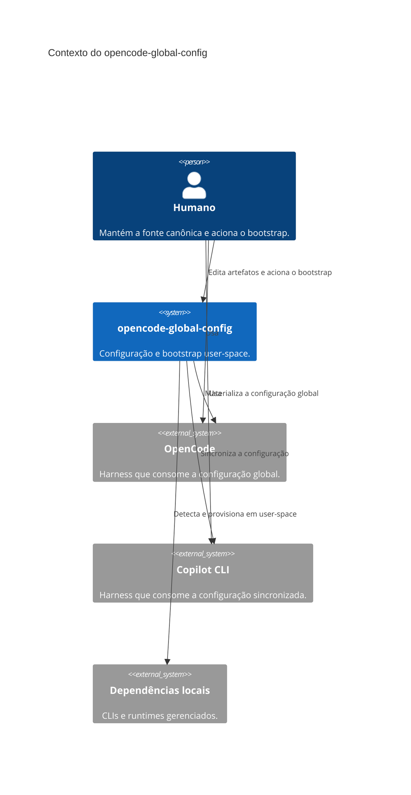

# Diagrama C4 L1: contexto do sistema

Este diagrama resume o contexto do `opencode-global-config` a partir das ADRs
0001–0006 e do código existente. O sistema é a fonte canônica das configurações
e do bootstrap dos harnesses instalados.

