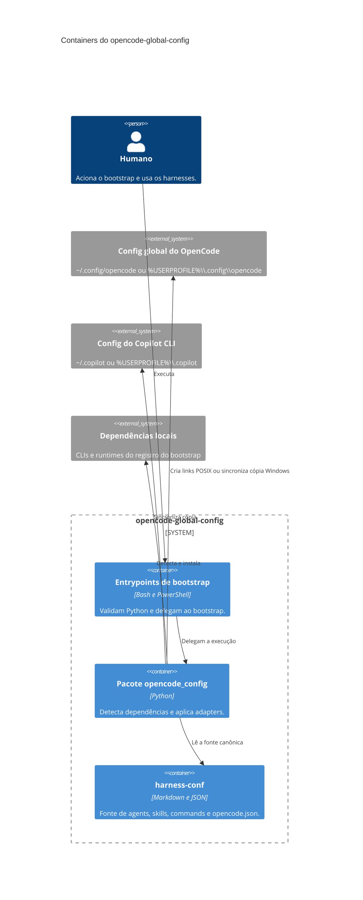

# Diagrama C4 L2: containers

O nível 2 mostra os containers definidos pelos entrypoints e pelo pacote
Python. Os destinos dos harnesses aparecem como sistemas externos porque ficam
fora do checkout.

