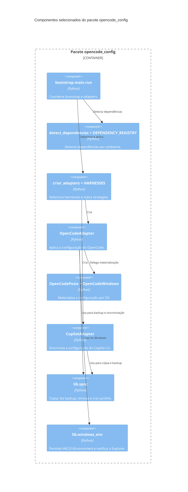

# Diagrama C4 L3: componentes selecionados

O L3 aplica um critério seletivo. Entram somente componentes que concentram
decisões arquiteturais ou complexidade de ambiente: fluxo do bootstrap,
registro e factory de harnesses, strategies por sistema operacional,
materialização, sincronização e persistência de variáveis no Windows.

Wrappers finos, dataclasses, helpers puros repetidos e testes ficam fora. O
diagrama não representa todos os arquivos nem repete componentes padronizados.

