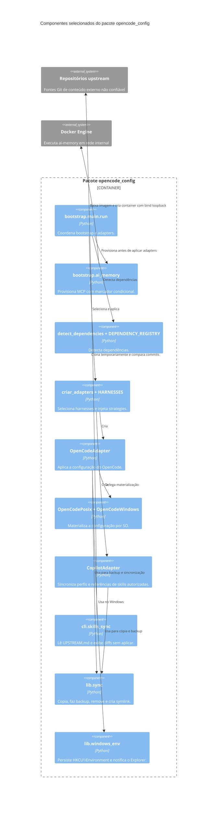

# Diagrama C4 L3: componentes selecionados

O L3 aplica um critério seletivo. Entram somente componentes que concentram
decisões arquiteturais ou complexidade de ambiente: fluxo do bootstrap,
registro e factory de harnesses, strategies por sistema operacional,
materialização, sincronização, referências de skills por perfil, detecção
read-only de upstreams e persistência de variáveis no Windows.
Provisionamento local do ai-memory e injeção condicional de MCP também entram.

Wrappers finos, dataclasses, helpers puros repetidos e testes ficam fora. O
diagrama não representa todos os arquivos nem repete componentes padronizados.

```mermaid
C4Component
    title Componentes selecionados do pacote opencode_config

    Container_Boundary(pacote, "Pacote opencode_config") {
        Component(bootstrap_run, "bootstrap.main.run", "Python", "Coordena bootstrap e adapters.")
        Component(ai_memory_provisioner, "bootstrap.ai_memory", "Python", "Provisiona MCP com marcador condicional.")
        Component(dependency_flow, "detect_dependencies + DEPENDENCY_REGISTRY", "Python", "Detecta dependências.")
        Component(harness_factory, "criar_adapters + HARNESSES", "Python", "Seleciona harnesses e injeta strategies.")
        Component(opencode_adapter, "OpenCodeAdapter", "Python", "Aplica a configuração do OpenCode.")
        Component(opencode_strategy, "OpenCodePosix + OpenCodeWindows", "Python", "Materializa a configuração por SO.")
        Component(copilot_adapter, "CopilotAdapter", "Python", "Sincroniza perfis e referências de skills autorizadas.")
        Component(skills_sync, "cli.skills_sync", "Python", "Lê UPSTREAM.md e exibe diffs sem aplicar.")
        Component(sync_lib, "lib.sync", "Python", "Copia, faz backup, remove e cria symlink.")
        Component(windows_env, "lib.windows_env", "Python", "Persiste HKCU\\Environment e notifica o Explorer.")
    }

    System_Ext(upstreams, "Repositórios upstream", "Fontes Git de conteúdo externo não confiável")
    System_Ext(docker, "Docker Engine", "Executa ai-memory em rede internal")

    Rel(bootstrap_run, dependency_flow, "Detecta dependências")
    Rel(bootstrap_run, ai_memory_provisioner, "Provisiona antes de aplicar adapters")
    Rel(ai_memory_provisioner, docker, "Baixa imagem e cria container com bind loopback")
    Rel(bootstrap_run, harness_factory, "Seleciona e aplica")
    Rel(harness_factory, opencode_adapter, "Cria")
    Rel(harness_factory, copilot_adapter, "Cria")
    Rel(opencode_adapter, opencode_strategy, "Delega materialização")
    Rel(opencode_adapter, sync_lib, "Usa para backup e sincronização")
    Rel(opencode_adapter, windows_env, "Usa no Windows")
    Rel(copilot_adapter, sync_lib, "Usa para cópia e backup")
    Rel(skills_sync, upstreams, "Clona temporariamente e compara commits")
```
