# Workflow de Agentes — Desenvolvimento (`dev`)

## Objetivo

Workflow multi-agente para desenvolvimento de funcionalidades,
otimizado para:
- **separação de contexto** por especialidade;
- **redução de consumo de tokens** via delegação focada;
- **qualidade** através de gates de revisão obrigatórios;
- **governança** com o humano no loop em pontos-chave;
- **higiene de contexto** — cada fase roda em instância
  nova, usando o arquivo de planejamento como handoff.

## Agentes

| Sigla             | Nome completo          | Tipo               | Fases onde atua                                              |
|-------------------|------------------------|---------------------|--------------------------------------------------------------|
| `orq`             | Orquestrador           | Roteador stateless  | todas (roteia)                                               |
| `eng-software`    | Engenheiro de Software | Executor            | Planejamento, Construção, Ajustes integrativos               |
| `front`           | Engenheiro Frontend    | Executor            | Planejamento, Construção, Revisão do Plano, Revisão da Construção |
| `curador-produto` | Curador de Produto     | Executor            | Validação, Revisão do Plano, Revisão da Construção, Finalização |
| `dba`             | Analista de BD         | Executor            | Planejamento, Construção, Revisão do Plano, Revisão da Construção |
| `sec`             | Analista Cyber         | Executor            | Planejamento, Construção, Revisão do Plano, Revisão da Construção, Testes |
| `rev`             | Revisor Integrativo    | Executor            | Revisão do Plano, Revisão da Construção                        |
| `qa`              | Testador               | Executor            | Planejamento, Revisão do Plano, Revisão da Construção, Testes  |

### Especialidades

| Agente             | No planejamento                                        | Na construção                                                                          | Na validação                                                                              |
|--------------------|--------------------------------------------------------|----------------------------------------------------------------------------------------|-------------------------------------------------------------------------------------------|
| `orq`              | Roteia fases, spawna agentes, mantém Status do arquivo | Roteia fases, spawna agentes, mantém Status do arquivo                                 | Roteia fases, spawna agentes, verifica evidências de harness                              |
| `eng-software`     | Planeja implementação do código                        | TDD (testes → código → refatoração); aplica ajustes integrativos                       | —                                                                                         |
| `curador-produto`  | —                                                      | —                                                                                      | Valida entrada contra Mapa; guardião do Mapa; revisa docs nos loops; co-confecciona harness; revisão final |
| `dba`              | Modela dados                                           | Atualiza modelo, scripts, informa `eng-software` quais classes/comportamentos alterar  | Revisa e corrige artefatos de BD; devolve resumo                                          |
| `sec`              | Analisa requisitos de segurança (pós-plano de código)  | Gera configs de segurança se necessário                                                | Revisa e corrige segurança; planeja e executa testes de segurança; devolve resumo          |
| `qa`               | Planeja testes manuais, aceitação, exploratórios       | —                                                                                      | Revisa e corrige cobertura de testes; executa testes automatizados e manuais; devolve resumo |
| `front`            | Prototipar telas, validar identidade visual com humano | Implementar UI conforme identidade visual aprovada                                     | Revisa aderência à identidade visual aprovada                                             |
| `rev`              | —                                                      | —                                                                                      | Revisão integrativa: consistência entre partes e aderência ao plano; não corrige — devolve relatório |

## Contratos do Workflow

O workflow se apoia em quatro contratos formais. Cada um
é um artefato do projeto — deve existir, ser mantido e
ser verificável.

### 1. Mapa do Produto

Seção no arquivo de contexto do agente (AGENTS.md,
instructions.md ou equivalente) que define como a
documentação do produto se organiza e como deve ser
mantida. É o contrato de documentação do projeto.
Definição e criação: ver `docs/workflow-curadoria.md`.
Premissa de consumo: 21.

### 2. Harness por Agente

Regras de contenção e direcionamento de cada agente —
ativadas como regras de prompt, ferramentas ou scripts.
O Harness deve estar listado no Mapa do Produto.
Definição e criação: ver `docs/workflow-curadoria.md`.
Premissas de execução: 32–36.

### 3. Arquivo de Planejamento

Arquivo temporário que serve de fonte de verdade durante
o processamento do workflow. É gerado pelos agentes e é 
a entrada e saída de cada um deles — todo resultado é persistido 
nele, todo contexto é lido dele. Descartável ao fim do processo.
Premissas detalhadas: 17–20.

### 4. Verificação de Harness

Saída obrigatória dos agentes: lista de evidências de
execução do harness apontando para logs ou artefatos que
comprovem o cumprimento das regras. O `orq` é responsável
por verificar essas evidências — **esta é a sua tarefa
mais importante**. Premissas detalhadas: 32–36.

### 5. Elementos de Especificação

O Mapa do Produto define para cada elemento de
especificação do software: (1) o que é,
(2) formato/ferramenta, (3) qual agente cria, (4) em
qual fase, (5) onde vive permanentemente.

O padrão de preenchimento — inicializar, enriquecer
incrementalmente, nunca re-perguntar o que já está
registrado, curador valida — aplica-se a **todos** os
elementos de spec mapeados, não apenas a um.

**Exemplo: Regras de Produto** — seção no arquivo de
planejamento que reúne restrições técnicas de domínio
por campo (tamanho máximo, tipo/formato, máscara de
exibição, limites numéricos, regras de validação). É o
contrato de dados do domínio. `eng-software` inicializa
a seção ao planejar; qualquer agente que precisar de uma
regra ausente consulta a seção, pergunta ao humano se
não estiver registrada e registra antes de prosseguir.
Regras já registradas nunca são reperguntadas.

Outros elementos de spec (requisitos, critérios de
aceitação, plano de testes, modelo de dados, threat
model, etc.) seguem o mesmo padrão — o Mapa define o
que, quem, quando e onde para cada um.
Premissas detalhadas: 21.1–21.3.

## Premissas

### Orquestração

1. **`orq` como roteador stateless** — lê o arquivo de
   planejamento, identifica a fase atual pelo campo
   `Status`, spawna o agente adequado e recebe de volta
   apenas um resumo curto. `orq` **nunca executa** tarefas
   de domínio; suas funções são **rotear** e **verificar
   evidências de harness** (ver premissa 35).
2. **Contrato de retorno: resultado no arquivo, resumo
   curto** — todo agente spawnado por `orq` persiste seu
   resultado no arquivo de planejamento e retorna apenas
   um resumo curto (≤ 5 linhas). Isso mantém o contexto
   do `orq` leve ao longo de todo o workflow.
3. **Instância nova a cada fase** — quando uma fase
   termina, `orq` spawna instância nova do agente para a
   próxima fase. Nenhum agente executor carrega contexto
   de fases anteriores. Isso é **obrigatório** quando há
   volta a fases anteriores (gate de refatoração,
   re-revisões) e **recomendado** para todas as
   transições.
4. **Qualquer agente pode consultar o humano** a qualquer
   momento para esclarecer dúvidas da sua especialidade.
5. **Falha de agente** — se não consegue completar a
   tarefa (erro, incerteza, falta de informação), registra
   o impedimento no arquivo e retorna resumo ao `orq`,
   que consulta o humano para decidir: corrigir e
   retentar, ajustar escopo, ou pular com registro.
6. **Agentes são agnósticos do workflow** — o prompt de
   cada agente descreve **capacidades** (o que sabe
   fazer), nunca fases ou sequência do workflow. Apenas
   o `orq` conhece o workflow e decide quando chamar
   cada agente. Os demais agentes funcionam tanto
   sozinhos (chamados diretamente pelo humano) quanto
   orquestrados (spawnados pelo `orq`), sem mudança
   no prompt.
7. **Seleção de modelo por fase** — ao iniciar o workflow,
   `orq` pergunta ao humano (via tool `ask`/`question`)
   qual modelo usar. A pergunta oferece duas opções:
   - **Usar o modelo atual para todas as fases** — nenhuma
     parada adicional entre fases.
   - **Definir por fase** — o humano lista no formato
     `<nº>. <modelo>` (fases omitidas usam modelo atual):
     ```
     1-VALIDAÇÃO  2-PLANEJAMENTO  3-REVISÃO DO PLANO
     4-CONSTRUÇÃO  5-REVISÃO DA CONSTRUÇÃO  6-TESTES
     7-FINALIZAÇÃO
     ```
   O mapa de modelos é registrado no arquivo de
   planejamento. Aplicação por plataforma:
   - **VS Code**: `orq` passa `model` ao `runSubagent`.
   - **OpenCode**: `orq` para antes de fases com modelo
     diferente do anterior e solicita ao humano que
     troque o modelo antes de prosseguir.

### Governança

8. **Humano aprova o plano** antes da construção iniciar.
9. **Humano controla re-revisões** — após ajustes, o humano
   decide se resubmete para revisão ou segue adiante.
   Isso evita loops infinitos.
10. **Pós-planejamento, tudo se baseia no plano aprovado** —
    falhas de teste são tratadas como bugs.
11. **Planeje perguntando, execute com autonomia** — no
    planejamento, `eng-software` deve consultar o humano
    o máximo possível para alinhar escopo e expectativas.
    Na construção, deve executar com máxima autonomia,
    sem intervenções desnecessárias. A **única exceção**
    é o gate de refatoração (ver premissa 31).
12. **Granularidade sensível ao contexto** —
    `eng-software` deve avaliar o tamanho do plano em
    relação à capacidade de revisão do humano e ao
    contexto do agente. Se o plano for grande demais,
    sugere dividir. Se for pequeno demais, sugere agregar
    funcionalidades. A decisão final é do humano.
12.1. **Identidade visual como contrato** — quando o
    plano inclui protótipos de tela aprovados pelo
    humano, a identidade visual (paleta de cores,
    tipografia, layout estrutural, hierarquia visual,
    espaçamentos) é tratada como contrato. Na construção,
    `front` pode evoluir o código dos componentes, mas
    desvios da identidade visual aprovada requerem nova
    aprovação explícita do humano. O `rev` inclui
    aderência visual no checklist integrativo.

### Revisão

13. **Revisão híbrida: especialistas + integrativa** —
    revisores especializados (`dba`, `sec`, `qa`) revisam
    e corrigem artefatos da sua área, devolvendo resumo
    estruturado. `rev` atua como revisor integrativo:
    verifica consistência entre as partes e aderência ao
    plano, mas **não corrige** — devolve relatório para
    `eng-software` aplicar diretamente (exceto correções
    complexas, delegadas ao especialista).
14. **Revisores são sempre instâncias novas com contexto
    limpo** — toda revisão é executada por uma instância
    nova do agente, sem histórico da conversa anterior.
    O agente que planejou ou construiu **nunca** revisa
    na mesma instância. Isso elimina viés de confirmação
    e garante avaliação independente. **Esta regra não tem
    exceção e se aplica tanto aos revisores especializados
    (`dba`, `sec`, `qa`) quanto ao revisor integrativo
    (`rev`).**
15. **Base de revisão** — revisores avaliam com base no
    plano aprovado e nos insumos originais do humano
    (requisitos, critérios de aceitação, regras de
    negócio). O formato dos insumos não é prescrito
    pelo workflow.
16. **Formato do resumo de revisão especializada:**
    - **Achado**: o que estava errado
    - **Ação**: o que foi corrigido
    - **Severidade**: bloqueante ou melhoria

### Arquivo de planejamento

17. **Arquivo como fonte de verdade temporária** — plano,
    revisões e status das etapas ficam persistidos.
    Permite retomada em caso de interrupção.
    **O arquivo é descartável**: ao fim do processo de
    implementação, `curador-produto` o exclui, junto com
    quaisquer artefatos auxiliares gerados durante o
    planejamento (ex.: protótipos de tela em `plan/ui/`).
18. **Campo `Status` obrigatório** — o arquivo deve conter
    um campo de status no topo (ex.:
    `Status: CONSTRUÇÃO — etapa 2/3`) que permite ao
    `orq` identificar a fase atual sem interpretar o
    conteúdo. O agente que conclui uma fase atualiza o
    status antes de retornar ao `orq`.
19. **Regras de escrita do arquivo:**
    - Na **construção**, `eng-software` apenas marca
      etapas como concluídas (checkbox). O conteúdo do
      plano não é alterado.
    - Na **revisão**, resumos dos revisores e relatório
      do `rev` são persistidos na seção dedicada. O plano
      original permanece intacto.
    - Modificações no plano só ocorrem na fase de
      **Revisão do Plano**, antes da aprovação do humano,
      **ou durante o gate de refatoração** na construção
      (ver premissa 31).
    - Quando o plano é alterado durante a construção,
      o histórico da mudança (motivo, o que mudou, decisão
      do humano) deve ser registrado no arquivo para que
      todos os agentes tenham conhecimento e a retomada
      seja possível.
20. **Contexto via arquivo** — agentes usam o arquivo de
    planejamento como fonte de contexto, não o histórico
    acumulado da conversa.

### Mapa do Produto

21. **O workflow exige um Mapa do Produto** — a definição,
    criação e manutenção do Mapa são responsabilidade do
    `curador-produto` conforme descrito em
    `docs/workflow-curadoria.md`. O `curador-produto`
    detecta ausência do Mapa na fase de VALIDAÇÃO e
    executa o processo de curadoria inline antes de
    devolver controle ao `orq`.
21.1. **Regras de Produto — preenchimento incremental** —
    a seção `## Regras de Produto` é inicializada por
    `eng-software` na fase de Planejamento com o que já
    for identificável dos requisitos. Campos sem definição
    recebem `(a definir)`. Em todas as fases, cada agente
    que precisar de uma regra ausente: (1) consulta a
    seção, (2) se não encontrar, pergunta ao humano,
    (3) registra antes de prosseguir. Nenhum agente
    repergunta o que já está registrado.
    Formato canônico da seção:

    | Campo | Tam. máx | Tipo/Formato | Máscara        | Limite numérico | Observação      |
    |-------|----------|--------------|----------------|-----------------|-----------------|
    | nome  | 100      | texto        | —              | —               | —               |
    | valor | —        | decimal      | —              | 0–999.999,99    | 2 casas         |

21.2. **Especificação evolutiva no planejamento** — a
    especificação (requisitos, critérios de aceitação,
    regras de produto) é dada como entrada, mas pode
    mudar durante o **planejamento**. Qualquer agente
    cuja pergunta ao humano resulte em mudança de spec
    deve registrar a alteração no arquivo de
    planejamento, na seção do elemento de spec
    correspondente (conforme o Mapa do Produto).
    **Distinção**: mudanças de "como" (arquitetura,
    abordagem técnica) não alteram spec; mudanças de
    "o quê" (escopo, requisitos, critérios de aceitação)
    alteram. O `curador-produto`, ao revisar o plano,
    verifica se mudanças de spec foram registradas e se
    estão consistentes com o Mapa. Na **construção**,
    a premissa 10 se mantém — tudo se baseia no plano
    aprovado. Se algo inviabilizar um critério de
    aceitação, o gate de refatoração (premissa 31) já
    trata o retorno ao planejamento.
21.3. **Documentação de spec por domínio** — o Mapa do
    Produto define, por projeto, quais artefatos de
    especificação cada agente deve criar ou atualizar,
    em qual formato e onde vivem permanentemente.
    Exemplos não-prescritivos: critérios de aceitação
    como specs executáveis (eng-software cria no TDD),
    plano de testes em arquivo permanente (qa extrai ao
    final), modelo de dados em DBML (dba cria/atualiza),
    threat model em docs/ (sec, se o Mapa definir).
    Cada agente, ao concluir sua fase, consulta o Mapa
    para verificar obrigações de documentação de spec em
    seu domínio para essa fase. Se o Mapa não definir
    obrigações para um agente/fase, nada a fazer.

### Papéis específicos

25. **`curador-produto` valida, não define** — verifica se
    a entrada do humano é consistente com o Mapa do
    Produto. Não cria escopo nem requisitos. Participa
    dos loops de revisão verificando se documentação
    planejada/produzida está conforme o Mapa. **Atualiza
    diretamente** o Mapa do Produto e documentação de
    produto; para artefatos de outros domínios (código,
    BD, segurança), devolve instruções de ajuste ao
    `orq`. Faz revisão final de documentação e
    estrutura.
    **Finalização — verificação de spec e exclusão do
    plano:** ao finalizar, `curador-produto` lê o Mapa
    e lista todos os artefatos de spec obrigatórios.
    Verifica existência de cada um. Para docs de
    produto: atualiza diretamente. Para artefatos de
    outros domínios: reporta lacunas ao `orq` com
    instrução de qual agente spawnar para extrair do
    plano efêmero. Após `orq` spawnar agentes e receber
    retorno, `curador-produto` revalida a completude.
    **Guarda do humano**: após cada rodada de correção,
    `orq` pergunta ao humano se deseja resubmeter para
    revalidação ou seguir adiante (similar à revisão,
    premissa 9). Isso evita loops infinitos. Só confirma
    conclusão (permitindo exclusão do plano e artefatos
    auxiliares temporários, ex.: protótipos de tela em
    `plan/ui/`) após verificar que toda documentação
    obrigatória existe **ou** após o humano decidir
    encerrar o loop.
26. **`sec` analisa após plano de código** — requisitos de
    segurança são avaliados com base no plano de
    implementação feito pelo `eng-software`.
27. **`qa` não analisa código** — foca em execução de
    testes.
28. **Testes de segurança são do `sec`**, não do `qa`.
    Isso inclui testes dinâmicos (DAST, pen testing
    automatizado) — são testes funcionais especializados
    em segurança, não testes de lógica de negócio.

### Construção

29. **Construção em três etapas (TDD):**
    1. **Testes primeiro** — `eng-software` implementa os
       testes automatizados que devem falhar.
    2. **Código** — implementa o código que faz os testes
       passarem.
    3. **Análise de refatoração** — avalia como acomodar o
       código novo ao existente.
30. **Na etapa de testes e código, `eng-software` executa
    com autonomia** — sem consultar o humano, seguindo o
    plano aprovado.
31. **Gate de refatoração** — a análise de refatoração é
    um ponto sensível. Acomodar código novo ao existente
    **pode mudar o plano**. Quando `eng-software`
    identifica essa possibilidade, **deve sempre consultar
    o humano**. Os cenários possíveis são:
    - Nada muda → segue normalmente.
    - Ajuste mínimo no plano → `eng-software` propõe,
      humano aprova, registra no arquivo e segue.
    - Mudança significativa → `eng-software` registra o
      estado no arquivo, atualiza o `Status` para
      `GATE-REFATORAÇÃO — volta ao planejamento` e
      retorna ao `orq`. O `orq` spawna nova instância
      para a fase de Revisão do Plano.
    Independente do cenário, a decisão e o motivo devem
    ser registrados no arquivo de planejamento para
    rastreabilidade e retomada.

### Harness por Agente

32. **Harness é definido no Mapa do Produto** — a criação
    e manutenção do harness são responsabilidade do
    `curador-produto` conforme descrito em
    `docs/workflow-curadoria.md`. Harness é **obrigatório
    na construção e na revisão**, sempre que o agente
    altera artefatos.
33. **Agente localiza seu harness antes de executar** —
    ao iniciar uma tarefa na construção ou revisão, o
    agente localiza o Mapa do Produto no arquivo de
    contexto do projeto e verifica se há harness
    configurado para ele. Se houver seção com
    regras/ferramentas, executa as regras aplicáveis à
    atividade atual (construção ou revisão). Se a seção
    contiver `SEM HARNESS A PEDIDO DO HUMANO`, segue sem
    harness. Se a seção não existir ou estiver vazia,
    recomenda ao humano acionar `curador-produto` para
    confeccionar/registrar antes de prosseguir.
34. **Evidência de execução do harness** — todo agente
    que possui harness deve produzir, ao final da sua
    execução, uma lista de evidências de cumprimento.
    Se o harness é um script: exit code + stdout são a
    evidência. Se é prompt-only: declaração estruturada
    com achados. A lista é persistida no arquivo de
    planejamento.
35. **Verificação de harness pelo `orq`** — após receber
    o retorno de um agente, `orq` verifica se as
    evidências de harness foram produzidas quando a seção
    do agente no Mapa contiver regras/ferramentas. Se
    estiverem ausentes ou incompletas, `orq` rejeita o
    retorno e solicita ao agente que complete a execução.
    Se a seção contiver `SEM HARNESS A PEDIDO DO HUMANO`,
    `orq` apenas valida que essa decisão foi respeitada.
    **Esta é a tarefa mais importante do `orq`** — garante
    que as regras de contenção estão sendo efetivamente
    seguidas, não apenas declaradas.
36. **Instalação de harness durante execução** — quando um
    agente com `bash: allow` identificar dependência de
    harness faltante, pode executar o script de instalação
    de harness do projeto para avançar com segurança.

> **Resumo da sequência harness:**
> agente localiza seção de harness no Mapa (P33) →
> executa regras aplicáveis à atividade atual →
> produz evidências (P34) → orq verifica (P35).

## Fluxo — Diagrama de Sequência

```mermaid
%%{init: {'theme': 'base', 'themeVariables': {
    'actorTextColor': '#000000',
    'signalTextColor': '#000000',
    'labelTextColor': '#000000',
    'noteBkgColor': '#ffffff',
    'noteTextColor': '#000000',
    'activationBorderColor': '#666666',
    'sequenceNumberColor': '#000000'
}}}%%
sequenceDiagram
    actor Humano
    participant orq as orq
    participant eng as eng-software
    participant front as front
    participant prod as curador-produto
    participant dba as dba
    participant sec as sec
    participant qa as qa
    participant rev as rev

    %% ── INÍCIO ──────────────────────────────
    Humano ->> orq: Nova funcionalidade (requisitos)
    orq ->> orq: Cria arquivo de planejamento<br/>Status: VALIDAÇÃO

    Note right of orq: Regra geral: após cada retorno<br/>de agente, orq verifica<br/>evidências de harness (P35)

    %% ── VALIDAÇÃO DE ENTRADA ────────────────────
    rect rgb(255, 250, 240)
    Note over Humano, rev: VALIDAÇÃO DE ENTRADA

    orq ->> prod: Validar entrada contra docs do produto

    alt Mapa/Harness ausente
        prod ->> prod: Executa fluxo de curadoria (inline)
        prod ->> Humano: Interage para criar Mapa/Harness
        prod -->> orq: Curadoria concluída (resumo curto)
    end

    alt Documentação OK
        prod -->> orq: Entrada válida (resumo curto)
    else Documentação inconsistente
        prod ->> Humano: Reporta inconsistências
        Humano -->> prod: Requisitos ajustados
        prod ->> prod: Revalida
        prod -->> orq: Entrada válida (resumo curto)
    end

    orq ->> orq: Atualiza Status: PLANEJAMENTO

    end

    %% ── PLANEJAMENTO ──────────────────────────
    rect rgb(230, 245, 255)
    Note over Humano, rev: PLANEJAMENTO

    orq ->> eng: Planejar implementação
    Note right of eng: eng-software consulta humano<br/>diretamente para alinhar escopo

    eng ->> Humano: Perguntas de escopo/requisitos
    Humano -->> eng: Respostas

    eng ->> eng: Elabora plano de código

    eng -->> orq: Plano persistido no arquivo (resumo curto)

    orq ->> front: Prototipar telas (se houver UI)
    alt Sem componente visual
        front -->> orq: Sem UI nesta funcionalidade (resumo curto)
    else Com componente visual
        front ->> front: Gera protótipos (HTML/SVG)
        front ->> Humano: Apresenta protótipos para aprovação visual
        Humano -->> front: Aprovação / ajustes visuais
        front ->> front: Itera até aprovação
        front -->> orq: Identidade visual aprovada (resumo curto)
    end

    orq ->> dba: Analisar modelagem de dados
    dba -->> orq: Modelo persistido no arquivo (resumo curto)

    orq ->> sec: Analisar requisitos de segurança
    Note right of sec: Recebe plano via arquivo
    sec -->> orq: Requisitos persistidos no arquivo (resumo curto)

    orq ->> qa: Planejar testes
    Note right of qa: Recebe plano via arquivo
    qa -->> orq: Plano de testes persistido (resumo curto)

    orq ->> orq: Atualiza Status: REVISÃO DO PLANO

    end

    %% ── REVISÃO DO PLANO ──────────────────────
    rect rgb(255, 245, 230)
    Note over Humano, rev: REVISÃO DO PLANO

    Note right of orq: Instâncias limpas —<br/>revisam e corrigem

    orq ->> dba: Revisar modelagem do plano
    dba ->> dba: Revisa, corrige e<br/>registra resumo no arquivo
    dba -->> orq: Resumo (achado · ação · severidade)

    orq ->> sec: Revisar segurança do plano
    sec ->> sec: Revisa, corrige e<br/>registra resumo no arquivo
    sec -->> orq: Resumo (achado · ação · severidade)

    orq ->> qa: Revisar testabilidade do plano
    qa ->> qa: Revisa, corrige e<br/>registra resumo no arquivo
    qa -->> orq: Resumo (achado · ação · severidade)

    orq ->> prod: Revisar documentação planejada (Mapa)
    prod ->> prod: Verifica aderência ao Mapa do Produto
    prod -->> orq: Resumo (achado · ação · severidade)

    orq ->> front: Revisar protótipos/planejamento de UI
    front ->> front: Revisa protótipos e<br/>registra resumo no arquivo
    front -->> orq: Resumo (achado · ação · severidade)

    Note right of orq: Revisão integrativa
    orq ->> rev: Revisão integrativa do plano
    rev ->> rev: Verifica consistência entre partes<br/>e aderência ao plano
    rev -->> orq: Relatório (achados integrativos)

    opt Ajustes necessários (rev + curador-produto)
        orq ->> eng: Aplicar ajustes (integrativos + documentação)
        eng -->> orq: Ajustes aplicados (resumo curto)
        opt Ajuste complexo demais para eng-software
            orq ->> dba: Ajustar modelagem
            dba -->> orq: Modelo ajustado (resumo curto)
        end
    end

    orq ->> Humano: Plano revisado. Resubmeter?
    alt Humano: sim
        orq ->> rev: Resubmete plano
        rev -->> orq: Feedback
    else Humano: não, seguir
        Note right of orq: Segue para aprovação
    end

    orq ->> Humano: Apresenta plano para aprovação
    Humano -->> orq: Aprovação / ajustes

    orq ->> orq: Atualiza Status: CONSTRUÇÃO

    end

    %% ── CONSTRUÇÃO ────────────────────────────
    rect rgb(230, 255, 230)
    Note over Humano, rev: CONSTRUÇÃO

    orq ->> dba: Criar/atualizar modelo, scripts e migrações
    dba -->> orq: Artefatos de BD persistidos (resumo curto)

    opt Funcionalidade envolve UI
        orq ->> front: Implementar telas
        Note right of front: Usa protótipos aprovados<br/>como referência visual
        front -->> orq: UI implementada (resumo curto)
    end

    orq ->> eng: Implementar (TDD)
    Note right of eng: Etapa 1 — Testes primeiro<br/>Etapa 2 — Código

    Note right of eng: Etapa 3 — Gate de refatoração
    eng ->> eng: Analisa como acomodar<br/>código novo ao existente

    alt Refatoração não afeta o plano
        eng ->> eng: Aplica refatoração e segue
        eng -->> orq: Construção concluída (resumo curto)
        orq ->> orq: Atualiza Status:<br/>REVISÃO DA CONSTRUÇÃO
    else Refatoração pode mudar o plano
        eng ->> Humano: Propõe ajustes ao plano
        alt Humano: ajuste mínimo
            eng ->> eng: Atualiza plano no arquivo<br/>(registra motivo e decisão)
            eng -->> orq: Construção concluída (resumo curto)
            orq ->> orq: Atualiza Status:<br/>REVISÃO DA CONSTRUÇÃO
        else Humano: mudança significativa
            eng ->> eng: Registra pausa no arquivo
            eng -->> orq: Gate disparado —<br/>volta ao planejamento
            orq ->> orq: Atualiza Status:<br/>REVISÃO DO PLANO
            Note right of orq: Spawna nova instância<br/>de eng-software
        else Humano: nada muda
            eng ->> eng: Registra decisão e segue
            eng -->> orq: Construção concluída (resumo curto)
            orq ->> orq: Atualiza Status:<br/>REVISÃO DA CONSTRUÇÃO
        end
    end

    end

    %% ── REVISÃO DA CONSTRUÇÃO ─────────────────
    rect rgb(255, 245, 230)
    Note over Humano, rev: REVISÃO DA CONSTRUÇÃO

    Note right of orq: Instâncias limpas —<br/>revisam e corrigem

    orq ->> dba: Revisar artefatos de BD
    dba ->> dba: Revisa, corrige e<br/>registra resumo no arquivo
    dba -->> orq: Resumo (achado · ação · severidade)

    orq ->> sec: Revisar segurança da implementação
    sec ->> sec: Revisa, corrige e<br/>registra resumo no arquivo
    sec -->> orq: Resumo (achado · ação · severidade)

    orq ->> qa: Revisar cobertura de testes
    qa ->> qa: Revisa, corrige e<br/>registra resumo no arquivo
    qa -->> orq: Resumo (achado · ação · severidade)

    orq ->> prod: Revisar documentação produzida (Mapa)
    prod ->> prod: Verifica aderência ao Mapa do Produto
    prod -->> orq: Resumo (achado · ação · severidade)

    orq ->> front: Revisar aderência visual da implementação
    front ->> front: Compara implementação contra<br/>identidade visual aprovada
    front -->> orq: Resumo (achado · ação · severidade)

    Note right of orq: Revisão integrativa
    orq ->> rev: Revisão integrativa da construção
    rev ->> rev: Verifica consistência entre partes<br/>e aderência ao plano
    rev -->> orq: Relatório (achados integrativos)

    opt Ajustes necessários (rev + curador-produto)
        orq ->> eng: Aplicar ajustes (integrativos + documentação)
        eng -->> orq: Ajustes aplicados (resumo curto)
        opt Ajuste complexo demais para eng-software
            orq ->> dba: Ajustar artefatos de BD
            dba -->> orq: Ajustes aplicados (resumo curto)
            orq ->> sec: Ajustar segurança
            sec -->> orq: Ajustes aplicados (resumo curto)
            orq ->> front: Ajustar UI
            front -->> orq: Ajustes aplicados (resumo curto)
        end
    end

    orq ->> Humano: Revisão concluída. Resubmeter?
    alt Humano: sim
        orq ->> rev: Resubmete construção
        rev -->> orq: Feedback
    else Humano: não, seguir
        Note right of orq: Segue para testes
    end

    orq ->> orq: Atualiza Status: TESTES

    end

    %% ── TESTES ────────────────────────────────
    rect rgb(245, 230, 255)
    Note over Humano, rev: TESTES

    orq ->> qa: Executar testes automatizados + manuais
    qa -->> orq: Resultado dos testes (resumo curto)

    opt Testes falharam
        orq ->> eng: Corrigir com base no feedback
        eng -->> orq: Correções aplicadas (resumo curto)
        orq ->> Humano: Ajustes feitos. Re-executar testes?
        alt Humano: sim
            orq ->> qa: Re-executar testes
            qa -->> orq: Resultado (resumo curto)
        else Humano: não, seguir
            Note right of orq: Segue para testes de segurança
        end
    end

    orq ->> sec: Executar testes de segurança
    sec -->> orq: Resultado (resumo curto)

    opt Testes de segurança falharam
        orq ->> eng: Corrigir com base no feedback
        eng -->> orq: Correções aplicadas (resumo curto)
        orq ->> Humano: Ajustes feitos. Re-executar testes?
        alt Humano: sim
            orq ->> sec: Re-executar testes de segurança
            sec -->> orq: Resultado (resumo curto)
        else Humano: não, seguir
            Note right of orq: Segue para finalização
        end
    end

    orq ->> orq: Atualiza Status: FINALIZAÇÃO

    end

    %% ── FINALIZAÇÃO ───────────────────────────
    rect rgb(255, 255, 230)
    Note over Humano, rev: FINALIZAÇÃO

    orq ->> prod: Revisão final — verificar artefatos de spec (Mapa)
    prod ->> prod: Lê Mapa, verifica existência<br/>de cada artefato de spec
    prod ->> prod: Atualiza docs de produto (se lacunas)
    prod -->> orq: Relatório: lacunas de spec<br/>por domínio (resumo curto)

    loop Revalidação (guarda do humano)
        opt Lacunas em outros domínios
            Note right of orq: orq spawna cada especialista<br/>indicado pelo curador (eng, dba,<br/>sec, qa, front — conforme Mapa)
            orq ->> eng: Extrair/criar artefato de spec<br/>do domínio indicado
            eng -->> orq: Artefatos criados (resumo curto)
        end
        orq ->> prod: Revalidar completude
        prod -->> orq: Relatório atualizado (resumo curto)
        alt Tudo OK
            Note right of orq: Sai do loop
        else Ainda há lacunas
            orq ->> Humano: Lacunas restantes. Resubmeter?
            alt Humano: sim
                Note right of orq: Continua loop
            else Humano: não, seguir
                Note right of orq: Sai do loop
            end
        end
    end

    orq ->> Humano: Funcionalidade concluída. Excluir plano?
    Humano -->> orq: Aprovação
    orq ->> prod: Excluir plano e artefatos auxiliares
    prod -->> orq: Plano excluído

    end
```



## Notas de Implementação

### Interação agente–humano por plataforma

| Plataforma | Como `orq` spawna agentes            | Quem pode interagir com o humano                  |
|------------|---------------------------------------|----------------------------------------------------|
| **VS Code**    | `runSubagent` com agentes primários   | Apenas agentes primários (`.agent.md`)             |
| **OpenCode**   | Subagentes                            | Qualquer agente configurado com a tool `ask`       |

**VS Code**: para que agentes spawnados pelo `orq` consigam
consultar o humano diretamente (premissa 4), eles precisam
ser configurados como **agentes primários** (`.agent.md`).
Esta é uma restrição da plataforma — apenas agentes primários
chamados por outro agente podem interagir com o humano.

**OpenCode**: subagentes podem interagir com o humano desde
que configurados com o ferramental adequado (tool `ask`).
Não há restrição de tipo de agente.
