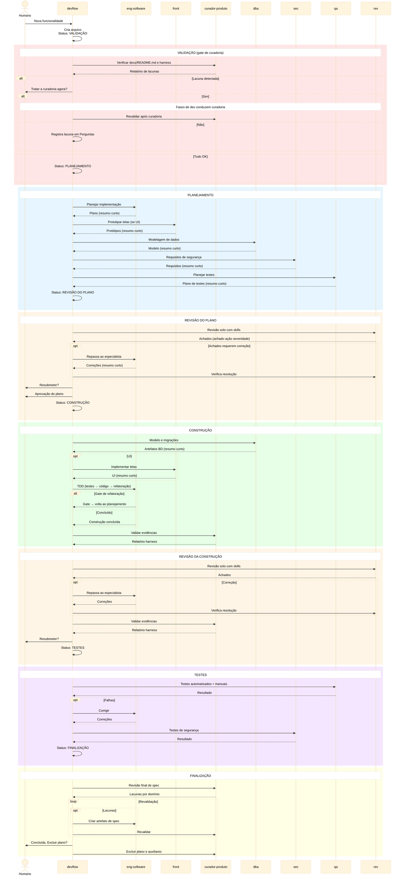

# Workflow de Agentes — Desenvolvimento (`dev`)

## Objetivo

Workflow multi-agente para desenvolvimento de funcionalidades,
otimizado para:
- **separação de contexto** por especialidade;
- **redução de consumo de tokens** via delegação focada;
- **qualidade** através de gates de revisão obrigatórios;
- **governança** com o humano no loop em pontos-chave;
- **higiene de contexto** — cada fase roda em instância
  nova, usando o arquivo de planejamento como handoff.

## Sequência de Workflows

```
devflow
  └── VALIDAÇÃO (gate de curadoria)  ← Verifica docs/README.md e Harness
  └── workflow-definicao-escopo.md   ← Elicita requisitos
  └── workflow-agentes-dev.md        ← Desenvolvimento (este arquivo)
```

- **Gate de curadoria** (fase VALIDAÇÃO) — garante que docs/README.md
  e Harness existem e estão válidos. Se lacuna, o humano
  decide se trata a curadoria agora (conduzida pelas fases
  de dev) ou segue com lacuna registrada. Ver seção
  "Trabalho de curadoria" abaixo.
- [`workflow-definicao-escopo.md`](workflow-definicao-escopo.md) —
  elicita requisitos e produz o Arquivo de Planejamento.
- Este workflow — executa o ciclo completo de desenvolvimento
  a partir do Arquivo de Planejamento já preenchido.

## Agentes

| Sigla | Nome completo | Tipo | Fases onde atua |
|---|---|---|---|
| `devflow` | Orquestrador | Roteador | Todas; apenas roteia |
| `eng-software` | Engenheiro de Software | Executor/Committer | Planejamento e construção |
| `front` | Engenheiro Frontend | Executor | Planejamento, construção e revisões |
| `curador-produto` | Curador de Produto | Executor | Validação, revisões e finalização |
| `dba` | Analista de BD | Executor | Planejamento, construção e revisões |
| `sec` | Analista Cyber | Executor | Planejamento, construção, revisões e testes |
| `rev` | Revisor Integrativo | Executor | Revisões do plano e da construção |
| `qa` | Testador | Executor | Planejamento, revisões e testes |

## Commits

O `eng-software` é o **único committer** do workflow.
Especialistas (`dba`, `sec`, `qa`, `front`, `rev`,
`curador-produto`) são subagentes: editam arquivos e
reportam `[arquivos alterados + resumo ≤5 linhas]` ao
solicitante. O `eng-software` revisa o diff do especialista
antes de commitar.

O `eng-software` carrega e segue a skill
`git-workflow-and-versioning`: commits atômicos por unidade
lógica, higiene pré-commit, mensagens Conventional Commit.
Nunca inclui alterações alheias não reportadas. Nunca
executa `git push` sem confirmação explícita do humano.

### Especialidades

| Agente | Planejamento | Construção | Validação |
|---|---|---|---|
| `devflow` | Roteia fases e mantém Status | Roteia fases e mantém Status | Roteia fases |
| `eng-software` | Planeja o código | TDD e ajustes integrativos | — |
| `curador-produto` | — | — | Valida docs/README.md, harness e evidências |
| `dba` | Modela dados | Atualiza modelo e scripts | Revisa artefatos de BD |
| `sec` | Analisa segurança | Gera configurações | Revisa segurança e testa |
| `qa` | Planeja testes | — | Revisa cobertura e executa testes |
| `front` | Prototipa telas | Implementa UI | Revisa identidade visual |
| `rev` | — | — | Revisão solo com skills de domínio |

> **Nota de sequenciamento:** `sec` analisa requisitos
> de segurança com base no plano do `eng-software` — por
> isso é spawnado após o engenheiro no planejamento.

## Contratos do Workflow

### 1. docs/README.md

Contrato de documentação do projeto. Contém 3 seções:
Definição de Escopo, Elementos de Especificação e
Estratégias de Indexação de Código. Criação e manutenção:
`curador-produto` (via gate de curadoria ou trabalho de curadoria).

### 2. Harness por Agente

Regras de contenção de cada agente — ativadas como regras
de prompt, ferramentas ou scripts. Listado no AGENTS.md.
Criação e manutenção: `curador-produto` (via trabalho de
curadoria).

### 3. Arquivo de Planejamento

Fonte de verdade temporária durante o workflow. Gerado pelos
agentes, é entrada e saída de cada um. Descartável ao fim.
Ver schema na seção "Schema do arquivo de planejamento".

### 4. Verificação de Harness

Evidências de execução do harness (logs ou artefatos).
O `curador-produto` valida em lote ao final das fases de
**Construção** e **Revisão da Construção** (quando houve
modificações). O `devflow` decide a ação sobre falhas.

### 5. Elementos de Especificação

O docs/README.md define para cada elemento: o que é,
formato/ferramenta, qual agente cria, em qual fase, onde
vive permanentemente. O padrão de preenchimento —
inicializar, enriquecer incrementalmente, nunca
re-perguntar o que já está registrado, curador valida —
aplica-se a **todos** os elementos mapeados.

**Exemplo: Regras de Produto** — seção no arquivo de
planejamento com restrições técnicas de domínio por campo.
`eng-software` inicializa ao planejar; agentes consultam,
perguntam ao humano se ausente, registram antes de
prosseguir. Regras já registradas nunca são reperguntadas.

## Premissas

### Orquestração

1. **`devflow` como roteador stateless** — lê o arquivo,
   identifica a fase pelo `Status`, spawna o agente adequado
   e recebe resumo curto. **Nunca executa** tarefas de
   domínio. Ao final das fases de Construção e Revisão da
   Construção (quando houve modificações), spawna
   `curador-produto` para validação em lote das evidências
   de harness. Se falhas, re-spawna agente ou consulta humano.
2. **Contrato de retorno** — todo agente persiste resultado
   no arquivo e retorna resumo curto (≤ 5 linhas). Ultima
   linha: `Skills: skill1, skill2` ou `Skills: nenhuma`.
3. **Instância nova a cada fase** — obrigatório em voltas
   (gate de refatoração, re-revisões) e recomendado para
   todas as transições.
4. **Mediação de perguntas** — agentes com dúvidas formulam
   perguntas, salvam progresso parcial e retornam ao
   `devflow`, que media (skill `question-orchestration`,
   fonte única). Controles: Checklist estrutural,
   Continuidade da mediação, Prompt-improver para handoff
   — ver `agents/devflow.md` para detalhes.
5. **Falha de agente** — registra impedimento e retorna.
   `devflow` consulta humano: corrigir e retentar, ajustar
   escopo, ou pular com registro.
6. **Agentes são agnósticos do workflow** — prompts descrevem
   capacidades, nunca fases. Apenas `devflow` conhece o
   workflow.
7. **Seleção de modelo por fase** — ao iniciar, `devflow`
   pergunta ao humano: modelo atual para todas as fases ou
   definir por fase. Mapa registrado no arquivo. Política de
   sessão: `{workflowId}-{fase}-{agente}`; retomada dentro
   da fase, sessão nova entre fases.

### Governança

8. **Humano aprova o plano** antes da construção.
9. **Humano controla re-revisões** — sem loops automáticos.
10. **Pós-planejamento, tudo se baseia no plano aprovado.**
11. **Planeje perguntando, execute com autonomia** — no
    planejamento, valide decisões não-triviais com o humano.
    Na construção, execute com autonomia. Exceção: gate de
    refatoração (premissa 31).
12. **Granularidade sensível ao contexto** — arquivo grande =
    escopo grande. `devflow` alerta e sugere divisão.
12.1. **Identidade visual como contrato** — desvios visuais
     requerem nova aprovação do humano.

### Revisão

13. **Revisão solo do `rev` com skills de domínio** — carrega
    skills aplicáveis (security-and-hardening, data-modeling,
    frontend-ui-engineering, tests-as-spec,
    api-and-interface-design, documentation-and-adrs) e
    revisa com checklist. **Não corrige** — reporta achados:
    `achado · ação · severidade`. `devflow` repassa ao
    especialista responsável.
14. **Instâncias novas com contexto limpo** — obrigatório,
    sem exceção. Elimina viés de confirmação.
15. **Base de revisão** — plano aprovado e insumos originais
    do humano. Formato não prescrito.
16. **Formato do resumo:** achado · ação · severidade
    (bloqueante ou melhoria).
27. **`qa` não analisa código** — foca em execução de testes.
28. **Testes de segurança são do `sec`**, não do `qa`.

### Arquivo de planejamento

17. **Fonte de verdade temporária** — descartável ao fim.
    `curador-produto` exclui plano e artefatos auxiliares.
17.1. **Seção de evidências de harness** —
     `## Evidências de Harness — <fase>`. `curador-produto`
     lê esta seção + AGENTS.md para validação em lote.
18. **Campo `Status` obrigatório** no topo. O agente que
    conclui uma fase atualiza o status antes de retornar.
19. **Regras de escrita:** na construção, apenas marca
    etapas concluídas. Na revisão, resumos são persistidos.
    Modificações no plano só na Revisão do Plano ou gate de
    refatoração. Histórico de mudanças registrado.
20. **Contexto via arquivo** — não via histórico da conversa.

### Schema do arquivo de planejamento

Seções obrigatórias na ordem:

```markdown
Status: <FASE> [— detalhe opcional]

## Regras de Produto

| Campo | Tam. máx | Tipo/Formato | Máscara | Limite | Obs |
|-------|----------|-------------|---------|--------|-----|

## Evidências de Harness — <fase>

(evidências de cada agente que atuou na fase)

## Perguntas

(perguntas pendentes de decisão humana)
```

- **Status**: `VALIDAÇÃO`, `PLANEJAMENTO`, `REVISÃO DO PLANO`,
  `CONSTRUÇÃO`, `GATE-REFATORAÇÃO — volta ao planejamento`,
  `REVISÃO DA CONSTRUÇÃO`, `TESTES`, `FINALIZAÇÃO`.
- **Regras de Produto**: tabela de restrições de domínio.
- **Evidências de Harness — <fase>**: uma seção por fase
  (Construção e Revisão da Construção).
- **Perguntas**: pendências de decisão humana.

### docs/README.md

21. **O workflow exige um docs/README.md** — criação e
    manutenção pelo `curador-produto`. Gate de curadoria detecta
    ausência ou problema. Se humano decidir tratar agora,
    fases de dev conduzem a curadoria. Se não, lacuna
    registrada e segue.
21.1. **Regras de Produto — preenchimento incremental** —
     `eng-software` inicializa no planejamento. Campos sem
     definição: `(a definir)`. Agentes consultam, perguntam
     se ausente, registram antes de prosseguir.
21.2. **Especificação evolutiva** — pode mudar durante o
     planejamento. Mudanças de "o quê" alteram spec;
     mudanças de "como" não. `curador-produto` verifica
     consistência.
21.3. **Documentação de spec por domínio** — docs/README.md
     define artefatos, formato e destino por agente/fase.
25. **`curador-produto` valida aderência ao docs/README.md** —
    não cria escopo nem requisitos. Na finalização, verifica
    existência de artefatos obrigatórios. Guarda do humano:
    após correção, pergunta se resubmete ou segue.

### Construção

29. **Construção em três etapas (TDD):** testes primeiro →
    código → análise de refatoração. Testes são
    especificação executável (ver skill `tests-as-spec`).
30. **Autonomia na construção** — sem consultar o humano,
    seguindo o plano aprovado.
31. **Gate de refatoração** — acomodar código novo ao
    existente pode mudar o plano. `eng-software` consulta
    humano: nada muda, ajuste mínimo (propõe e registra),
    ou mudança significativa (volta ao planejamento).

### Harness por Agente

32. **Harness no AGENTS.md** — criação pelo `curador-produto`.
    Obrigatório na construção; na revisão, só se modificou
    artefato. `SEM HARNESS A PEDIDO DO HUMANO` = decisão
    explícita. Script único por harness, idempotente.
33. **Agente localiza harness antes de executar** — se
    `SEM HARNESS`, segue. Se ausente/vazio, registra LACUNA.
    Se presente: construção executa; revisão só se modificou.
34. **Evidência** — saída JSON (`status`, `findings`, `prompt`)
    persistida no arquivo. `fail` → resolve e re-executa.
    `pass` → lê prompt. Sem modificação na revisão:
    `sem modificações — harness não executado`.
35. **Validação pelo `curador-produto`** — cruza seção de
    evidências com AGENTS.md. Executa agregador antes de
    cruzar. Reporta OK/FALHA/LACUNA. `devflow` decide ação.
36. **Instalação de harness** — agente com `bash: allow` pode
    executar script de instalação para avançar.

> **Resumo harness:** localiza (P33) → executa (P32) →
> fail: resolve e re-executa → pass: lê prompt →
> persiste evidência (P34) → `curador-produto` valida (P35)
> → `devflow` decide.

## Fluxo — Diagrama de Sequência



## Trabalho de curadoria

O trabalho de curadoria (criação e manutenção do
`docs/README.md` e harness por agente) é conduzido pelas
fases de dev quando o gate de curadoria da VALIDAÇÃO detecta lacuna
e o humano decide tratar agora.

### Gate de curadoria na VALIDAÇÃO

1. `curador-produto` verifica docs/README.md e harness.
2. Se lacuna: `devflow` pergunta **"Tratar a curadoria
   agora?"**
   - **Sim** → fases de dev conduzem a curadoria. Após
     concluir, volta ao gate para revalidar.
   - **Não** → registra lacuna em `## Perguntas` e segue.
3. Se tudo OK → segue para PLANEJAMENTO.

### Planejamento da curadoria (item a item)

`devflow` spawna `curador-produto` para percorrer cada
seção com o humano (mediação via blocos adaptativos da
`question-orchestration`):

- **docs/README.md** — Definição de Escopo, Elementos de
  Especificação, Regras de Documentação, Estratégias de
  Indexação. Cada seção requer aprovação explícita.
- **Harness** — linguagem, ferramenta por agente, orçamento,
  agregador. Cada entrada requer aprovação explícita.

### Construção da curadoria

1. `curador-produto` escreve o `docs/README.md` aprovado.
2. `curador-produto` spawna `eng-software` com briefing para
   implementar scripts de harness com TDD.
3. `curador-produto` registra tabela no `AGENTS.md`.

### Validação da curadoria

1. `eng-software` roda os harness implementados.
2. `curador-produto` verifica o verde — validação objetiva
   (resolve "não valida o que editou").
3. Verde → curadoria concluída. `devflow` volta ao gate de curadoria.

## Notas de Implementação

### Interação agente–humano por plataforma

| Plataforma | Como spawna | Comunicação |
|---|---|---|
| **Copilot CLI** | `task(agent_type=...)` | Devflow media |
| **OpenCode** | Subagentes | Devflow media |

Subagentes retornam perguntas; `devflow` avalia e apresenta
ao humano. Exceção: agentes não mediados (ex: analista)
conversam direto com o humano.
