# Workflow de Agentes — Desenvolvimento de Software

## Objetivo

Workflow multi-agente para desenvolvimento de funcionalidades,
otimizado para:
- **separação de contexto** por especialidade;
- **redução de consumo de tokens** via delegação focada;
- **qualidade** através de gates de revisão obrigatórios;
- **governança** com o humano no loop em pontos-chave;
- **higiene de contexto** — cada fase roda em instância
  nova, usando o arquivo de planejamento como handoff.

## Agentes

| Sigla             | Nome completo          | Tipo               | Fases onde atua                                              |
|-------------------|------------------------|---------------------|--------------------------------------------------------------|
| `orq`             | Orquestrador           | Roteador stateless  | todas (roteia)                                               |
| `eng-software`    | Engenheiro de Software | Executor            | Planejamento, Construção, Ajustes integrativos               |
| `curador-produto` | Curador de Produto     | Executor            | Validação, Revisão do Plano, Revisão da Construção, Finalização |
| `dba`             | Analista de BD         | Executor            | Planejamento, Construção, Revisão do Plano, Revisão da Construção |
| `sec`             | Analista Cyber         | Executor            | Planejamento, Construção, Revisão do Plano, Revisão da Construção, Testes |
| `rev`             | Revisor Integrativo    | Executor            | Revisão do Plano, Revisão da Construção                        |
| `qa`              | Testador               | Executor            | Planejamento, Revisão do Plano, Revisão da Construção, Testes  |

### Especialidades

| Agente             | No planejamento                                        | Na construção                                                                          | Na validação                                                                              |
|--------------------|--------------------------------------------------------|----------------------------------------------------------------------------------------|-------------------------------------------------------------------------------------------|
| `orq`              | Roteia fases, spawna agentes, mantém Status do arquivo | Roteia fases, spawna agentes, mantém Status do arquivo                                 | Roteia fases, spawna agentes, verifica evidências de harness                              |
| `eng-software`     | Planeja implementação do código                        | TDD (testes → código → refatoração); aplica ajustes integrativos                       | —                                                                                         |
| `curador-produto`  | —                                                      | —                                                                                      | Valida entrada contra Mapa; guardião do Mapa; revisa docs nos loops; co-confecciona harness; revisão final |
| `dba`              | Modela dados                                           | Atualiza modelo, scripts, informa `eng-software` quais classes/comportamentos alterar  | Revisa e corrige artefatos de BD; devolve resumo                                          |
| `sec`              | Analisa requisitos de segurança (pós-plano de código)  | Gera configs de segurança se necessário                                                | Revisa e corrige segurança; planeja e executa testes de segurança; devolve resumo          |
| `qa`               | Planeja testes manuais, aceitação, exploratórios       | —                                                                                      | Revisa e corrige cobertura de testes; executa testes automatizados e manuais; devolve resumo |
| `rev`              | —                                                      | —                                                                                      | Revisão integrativa: consistência entre partes e aderência ao plano; não corrige — devolve relatório |

## Contratos do Workflow

O workflow se apoia em quatro contratos formais. Cada um
é um artefato do projeto — deve existir, ser mantido e
ser verificável.

### 1. Mapa do Produto

Seção no arquivo de contexto do agente (AGENTS.md,
instructions.md ou equivalente) que define como a
documentação do produto se organiza e como deve ser
mantida. É o contrato de documentação do projeto.
Premissas detalhadas: 20–23.

### 2. Harness por Agente

Documento com as regras de contenção e direcionamento
de cada agente — ativadas como regras de prompt,
ferramentas ou skills. `curador-produto` é co-responsável
por ajudar a confeccioná-lo e o Harness deve estar
listado no Mapa do Produto. Premissas detalhadas: 31–34.

### 3. Arquivo de Planejamento

Arquivo temporário que serve de fonte de verdade durante
o processamento do workflow. É gerado pelos agentes e é 
a entrada e saída de cada um deles — todo resultado é persistido 
nele, todo contexto é lido dele. Descartável ao fim do processo.
Premissas detalhadas: 16–19.

### 4. Verificação de Harness

Saída obrigatória dos agentes: lista de evidências de
execução do harness apontando para logs ou artefatos que
comprovem o cumprimento das regras. O `orq` é responsável
por verificar essas evidências — **esta é a sua tarefa
mais importante**. Premissas detalhadas: 31–34.

## Premissas

### Orquestração

1. **`orq` como roteador stateless** — lê o arquivo de
   planejamento, identifica a fase atual pelo campo
   `Status`, spawna o agente adequado e recebe de volta
   apenas um resumo curto. `orq` **nunca executa** tarefas
   de domínio; suas funções são **rotear** e **verificar
   evidências de harness** (ver premissa 34).
2. **Contrato de retorno: resultado no arquivo, resumo
   curto** — todo agente spawnado por `orq` persiste seu
   resultado no arquivo de planejamento e retorna apenas
   um resumo curto (≤ 5 linhas). Isso mantém o contexto
   do `orq` leve ao longo de todo o workflow.
3. **Instância nova a cada fase** — quando uma fase
   termina, `orq` spawna instância nova do agente para a
   próxima fase. Nenhum agente executor carrega contexto
   de fases anteriores. Isso é **obrigatório** quando há
   volta a fases anteriores (gate de refatoração,
   re-revisões) e **recomendado** para todas as
   transições.
4. **Qualquer agente pode consultar o humano** a qualquer
   momento para esclarecer dúvidas da sua especialidade.
5. **Falha de agente** — se não consegue completar a
   tarefa (erro, incerteza, falta de informação), registra
   o impedimento no arquivo e retorna resumo ao `orq`,
   que consulta o humano para decidir: corrigir e
   retentar, ajustar escopo, ou pular com registro.
6. **Agentes são agnósticos do workflow** — o prompt de
   cada agente descreve **capacidades** (o que sabe
   fazer), nunca fases ou sequência do workflow. Apenas
   o `orq` conhece o workflow e decide quando chamar
   cada agente. Os demais agentes funcionam tanto
   sozinhos (chamados diretamente pelo humano) quanto
   orquestrados (spawnados pelo `orq`), sem mudança
   no prompt.

### Governança

7. **Humano aprova o plano** antes da construção iniciar.
8. **Humano controla re-revisões** — após ajustes, o humano
   decide se resubmete para revisão ou segue adiante.
   Isso evita loops infinitos.
9. **Pós-planejamento, tudo se baseia no plano aprovado** —
   falhas de teste são tratadas como bugs.
10. **Planeje perguntando, execute com autonomia** — no
    planejamento, `eng-software` deve consultar o humano
    o máximo possível para alinhar escopo e expectativas.
    Na construção, deve executar com máxima autonomia,
    sem intervenções desnecessárias. A **única exceção**
    é o gate de refatoração (ver premissa 30).
11. **Granularidade sensível ao contexto** —
    `eng-software` deve avaliar o tamanho do plano em
    relação à capacidade de revisão do humano e ao
    contexto do agente. Se o plano for grande demais,
    sugere dividir. Se for pequeno demais, sugere agregar
    funcionalidades. A decisão final é do humano.

### Revisão

12. **Revisão híbrida: especialistas + integrativa** —
    revisores especializados (`dba`, `sec`, `qa`) revisam
    e corrigem artefatos da sua área, devolvendo resumo
    estruturado. `rev` atua como revisor integrativo:
    verifica consistência entre as partes e aderência ao
    plano, mas **não corrige** — devolve relatório para
    `eng-software` aplicar diretamente (exceto correções
    complexas, delegadas ao especialista).
13. **Revisores são sempre instâncias novas com contexto
    limpo** — toda revisão é executada por uma instância
    nova do agente, sem histórico da conversa anterior.
    O agente que planejou ou construiu **nunca** revisa
    na mesma instância. Isso elimina viés de confirmação
    e garante avaliação independente. **Esta regra não tem
    exceção e se aplica tanto aos revisores especializados
    (`dba`, `sec`, `qa`) quanto ao revisor integrativo
    (`rev`).**
14. **Base de revisão** — revisores avaliam com base no
    plano aprovado e nos insumos originais do humano
    (requisitos, critérios de aceitação, regras de
    negócio). O formato dos insumos não é prescrito
    pelo workflow.
15. **Formato do resumo de revisão especializada:**
    - **Achado**: o que estava errado
    - **Ação**: o que foi corrigido
    - **Severidade**: bloqueante ou melhoria

### Arquivo de planejamento

16. **Arquivo como fonte de verdade temporária** — plano,
    revisões e status das etapas ficam persistidos.
    Permite retomada em caso de interrupção.
    **O arquivo é descartável**: ao fim do processo de
    implementação, `curador-produto` o exclui.
17. **Campo `Status` obrigatório** — o arquivo deve conter
    um campo de status no topo (ex.:
    `Status: CONSTRUÇÃO — etapa 2/3`) que permite ao
    `orq` identificar a fase atual sem interpretar o
    conteúdo. O agente que conclui uma fase atualiza o
    status antes de retornar ao `orq`.
18. **Regras de escrita do arquivo:**
    - Na **construção**, `eng-software` apenas marca
      etapas como concluídas (checkbox). O conteúdo do
      plano não é alterado.
    - Na **revisão**, resumos dos revisores e relatório
      do `rev` são persistidos na seção dedicada. O plano
      original permanece intacto.
    - Modificações no plano só ocorrem na fase de
      **Revisão do Plano**, antes da aprovação do humano,
      **ou durante o gate de refatoração** na construção
      (ver premissa 30).
    - Quando o plano é alterado durante a construção,
      o histórico da mudança (motivo, o que mudou, decisão
      do humano) deve ser registrado no arquivo para que
      todos os agentes tenham conhecimento e a retomada
      seja possível.
19. **Contexto via arquivo** — agentes usam o arquivo de
    planejamento como fonte de contexto, não o histórico
    acumulado da conversa.

### Mapa do Produto

20. **O workflow exige um "Mapa do Produto"** — seção no
    arquivo de contexto do agente (ex.: AGENTS.md,
    instructions.md) que define como a documentação do
    produto se organiza e como deve ser mantida. Funciona
    como contrato de documentação: permite ao
    `curador-produto` validar entradas e verificar
    consistência.
21. **Conteúdo do Mapa é livre** — o workflow não prescreve
    formato nem conteúdo. Cada projeto preenche conforme
    sua realidade. O Mapa funciona como o hotspot do
    framework: a estrutura do workflow é fixa, o Mapa é
    o ponto de variação por projeto.
22. **`curador-produto` é o guardião do Mapa** — se a seção
    não existir, `curador-produto` detecta a ausência e
    pode sugerir uma organização inicial ao humano ou
    aceitar o que o humano fornecer. O humano decide o
    conteúdo; `curador-produto` orienta o processo se
    solicitado. **É o único agente que atualiza
    diretamente o Mapa do Produto** — mantém a seção
    atualizada ao longo do workflow (validação, revisões
    e finalização).
23. **Posicionamento recomendado** — o Mapa do Produto deve
    ficar no **início** do arquivo de contexto, logo após
    as regras globais de comportamento. LLMs têm viés de
    primazia e o Mapa é contexto fundacional: o agente
    precisa entender o produto antes de interpretar
    regras de workflow e executar tarefas.

### Papéis específicos

24. **`curador-produto` valida, não define** — verifica se
    a entrada do humano é consistente com o Mapa do
    Produto. Não cria escopo nem requisitos. Participa
    dos loops de revisão verificando se documentação
    planejada/produzida está conforme o Mapa. **Atualiza
    diretamente** o Mapa do Produto e documentação de
    produto; para artefatos de outros domínios (código,
    BD, segurança), devolve instruções de ajuste ao
    `orq`. Faz revisão final de documentação e
    estrutura. Ao fim do processo, exclui o arquivo de
    planejamento.
25. **`sec` analisa após plano de código** — requisitos de
    segurança são avaliados com base no plano de
    implementação feito pelo `eng-software`.
26. **`qa` não analisa código** — foca em execução de
    testes.
27. **Testes de segurança são do `sec`**, não do `qa`.

### Construção

28. **Construção em três etapas (TDD):**
    1. **Testes primeiro** — `eng-software` implementa os
       testes automatizados que devem falhar.
    2. **Código** — implementa o código que faz os testes
       passarem.
    3. **Análise de refatoração** — avalia como acomodar o
       código novo ao existente.
29. **Na etapa de testes e código, `eng-software` executa
    com autonomia** — sem consultar o humano, seguindo o
    plano aprovado.
30. **Gate de refatoração** — a análise de refatoração é
    um ponto sensível. Acomodar código novo ao existente
    **pode mudar o plano**. Quando `eng-software`
    identifica essa possibilidade, **deve sempre consultar
    o humano**. Os cenários possíveis são:
    - Nada muda → segue normalmente.
    - Ajuste mínimo no plano → `eng-software` propõe,
      humano aprova, registra no arquivo e segue.
    - Mudança significativa → `eng-software` registra o
      estado no arquivo, atualiza o `Status` para
      `GATE-REFATORAÇÃO — volta ao planejamento` e
      retorna ao `orq`. O `orq` spawna nova instância
      para a fase de Revisão do Plano.
    Independente do cenário, a decisão e o motivo devem
    ser registrados no arquivo de planejamento para
    rastreabilidade e retomada.

### Harness por Agente

31. **Harness é definido no Mapa do Produto** — o harness
    de cada agente é um artefato do projeto, definido e
    mantido no Mapa do Produto. Não é hardcoded no prompt
    do agente. `curador-produto` é co-responsável por
    orientar o humano na criação e registra o harness no
    Mapa. Cada projeto define quais regras e ferramentas
    compõem o harness de cada agente.
    **Preferência por ferramentas determinísticas** —
    sempre que possível, regras de harness devem ser
    implementadas via ferramentas determinísticas (linters,
    análise estática, testes automatizados, validadores
    de schema) em vez de depender apenas de instruções
    de prompt. Ferramentas determinísticas produzem
    resultados reproduzíveis e verificáveis.
    **Implementação preferencial: scripts executáveis** —
    a forma recomendada de implementar harness é via
    scripts que encapsulam as verificações determinísticas.
    Scripts produzem resultado binário (passa/falha),
    geram evidência automaticamente e são versionáveis.
32. **Agente localiza seu harness antes de executar** —
    ao iniciar uma tarefa, o agente localiza o Mapa do
    Produto no arquivo de contexto do projeto e verifica
    se há harness configurado para ele. Se houver script,
    executa-o. Se houver regras de prompt, segue-as. Se
    não houver harness, recomenda ao humano acionar
    `curador-produto` para confeccioná-lo antes de
    prosseguir.
33. **Evidência de execução do harness** — todo agente
    que possui harness deve produzir, ao final da sua
    execução, uma lista de evidências de cumprimento.
    Se o harness é um script: exit code + stdout são a
    evidência. Se é prompt-only: declaração estruturada
    com achados. A lista é persistida no arquivo de
    planejamento.
34. **Verificação de harness pelo `orq`** — após receber
    o retorno de um agente, `orq` verifica se as
    evidências de harness foram produzidas. Se estiverem
    ausentes ou incompletas, `orq` rejeita o retorno e
    solicita ao agente que complete a execução. **Esta é
    a tarefa mais importante do `orq`** — garante que
    as regras de contenção estão sendo efetivamente
    seguidas, não apenas declaradas.

> **Resumo da sequência harness:**
> agente localiza harness no Mapa (P32) → executa script
> ou regras → produz evidências (P33) → orq verifica (P34).

#### Convenção recomendada de scripts

A convenção abaixo é **recomendada** — o humano decide se
a adota ou usa outra estrutura.

```
harness/<agente>/<fase>.sh
```

- **Interface**: recebe como `$1` o path do arquivo de
  planejamento.
- **Saída**: exit 0 (ok) / exit 1 (bloqueante). Achados em
  stdout, uma linha por achado:
  `SEVERITY | TOOL | MESSAGE`
- **Versionamento**: scripts entram no git como artefatos
  do projeto.
- **Maturidade gradual**: projetos podem começar com
  harness prompt-only e migrar para scripts à medida que
  amadurecem. O `curador-produto` orienta essa migração.

#### Catálogo de sugestões de harness por agente

> **Nota importante:** as regras abaixo são um catálogo
> de referência para o `curador-produto` usar ao orientar
> o humano na criação de harness. **Não são regras
> obrigatórias.** O harness efetivo de cada agente é
> definido no Mapa do Produto de cada projeto.

##### eng-software

- **Smoke tests pós-construção** `prompt` `build`
  Executar todos os testes ao final da etapa de construção.
  Só prosseguir para a próxima fase se todos passarem.

- **Testes existentes são intocáveis** `prompt` `build`
  Se um teste que não estava previsto para modificação
  falhar após alterações, não ajustá-lo. Registrar a
  falha no arquivo e perguntar ao humano se o problema
  é no código novo ou no teste.

- **Regressão incremental** `prompt` `build`
  Após cada modificação em código que já possui testes
  sem previsão de alteração, executar esses testes para
  verificar que o comportamento existente não foi afetado.

- **Análise estática** `tool` `build · val`
  Usar ferramentas determinísticas do projeto (ESLint,
  ruff, mypy, pyright, shellcheck, hadolint, etc.) para
  validar o código antes de declarar a etapa concluída.
  Achados bloqueantes devem ser corrigidos antes de
  prosseguir.

##### dba

- **Validação de SQL** `tool` `build · val`
  Executar SQLFluff (ou linter SQL do projeto) em toda
  migration/DDL produzida. Achados de severidade error
  são bloqueantes.

- **Schema diff** `tool` `build`
  Após gerar migration, comparar schema resultante com o
  modelo "as code" (DBML/Prisma/etc.) usando diff
  automatizado. Divergências bloqueiam avanço.

- **IaC lint** `tool` `build · val`
  Se há infra de BD (Terraform, CloudFormation), validar
  com checkov/tflint antes de declarar concluído.

- **Nomenclatura determinística** `prompt` `build · val`
  Verificar se tabelas, colunas e índices seguem
  convenção do projeto (definida no Mapa do Produto).
  Divergências devem ser apontadas.

##### sec

- **SAST obrigatório** `tool` `build · val`
  Executar Semgrep (ou SAST do projeto) no código
  alterado. Findings de severidade high/critical são
  bloqueantes.

- **Secrets scan** `tool` `build`
  Executar gitleaks/git-secrets no diff. Qualquer
  segredo detectado é bloqueante.

- **Dependency check** `tool` `val`
  Verificar dependências com Snyk/npm audit/pip-audit.
  Vulnerabilidades críticas são bloqueantes.

- **OWASP Top 10 checklist** `prompt` `val`
  Na revisão, verificar se o código exposto trata os
  riscos OWASP aplicáveis. Registrar quais itens foram
  verificados e quais não se aplicam.

##### qa

- **Cobertura mínima** `tool` `val`
  Verificar se cobertura de testes não caiu em relação
  ao baseline. Queda acima do threshold do projeto
  bloqueia.

- **Testes de aceitação** `tool` `val`
  Executar specs de aceitação (BDD/Playwright/Cypress)
  definidas no plano. Falhas são bloqueantes.

- **Relatório estruturado** `prompt` `val`
  Produzir relatório com: total executados, passaram,
  falharam, skipped, cobertura delta. Persistir no
  arquivo de planejamento.

- **Acessibilidade (se aplicável)** `tool` `val`
  Em projetos frontend, executar axe-core ou equivalente.
  Violations de severidade critical são bloqueantes.

##### rev

- **Markdown lint** `tool` `val`
  Executar markdownlint nos artefatos de documentação
  produzidos. Erros de formatação devem ser reportados.

- **Link check** `tool` `val`
  Verificar links internos/externos em docs produzidas
  (markdown-link-check). Links quebrados são reportados.

- **Consistência cross-artefato** `prompt` `val`
  Verificar que nomes, convenções e referências são
  consistentes entre plano, código, testes e docs.
  Inconsistências viram achados no relatório.

- **Aderência ao plano** `prompt` `val`
  Comparar o que foi construído com o que foi planejado.
  Desvios não autorizados são achados bloqueantes.

##### curador-produto

- **Checklist do Mapa** `prompt` `val`
  Ao revisar, verificar se faltou atualizar alguma
  documentação com base no Mapa do Produto.

- **Atualiza Mapa diretamente** `prompt` `val`
  Quando a funcionalidade implementada altera estrutura,
  nomenclatura ou convenções do projeto, atualizar o Mapa
  do Produto diretamente (sem delegar).

- **Valida existência de harness** `prompt` `val`
  Verificar se todos os agentes que atuam no projeto
  possuem harness registrado no Mapa. Se não, alertar
  o humano.

- **Delega outros domínios** `prompt` `val`
  Para ajustes em código, BD ou segurança detectados na
  revisão, devolver instruções claras ao `orq` para
  delegar ao agente correto.

## Fluxo — Diagrama de Sequência

```mermaid
%%{init: {'theme': 'base', 'themeVariables': {
    'actorTextColor': '#000000',
    'signalTextColor': '#000000',
    'labelTextColor': '#000000',
    'noteBkgColor': '#ffffff',
    'noteTextColor': '#000000',
    'activationBorderColor': '#666666',
    'sequenceNumberColor': '#000000'
}}}%%
sequenceDiagram
    actor Humano
    participant orq as orq
    participant eng as eng-software
    participant prod as curador-produto
    participant dba as dba
    participant sec as sec
    participant qa as qa
    participant rev as rev

    %% ── INÍCIO ──────────────────────────────
    Humano ->> orq: Nova funcionalidade (requisitos)
    orq ->> orq: Cria arquivo de planejamento<br/>Status: VALIDAÇÃO

    Note right of orq: Regra geral: após cada retorno<br/>de agente, orq verifica<br/>evidências de harness (P33)

    %% ── VALIDAÇÃO DE ENTRADA ────────────────────
    rect rgb(255, 250, 240)
    Note over Humano, rev: VALIDAÇÃO DE ENTRADA

    orq ->> prod: Validar entrada contra docs do produto
    alt Documentação OK
        prod -->> orq: Entrada válida (resumo curto)
    else Documentação inconsistente
        prod ->> Humano: Reporta inconsistências
        Humano -->> prod: Requisitos ajustados
        prod ->> prod: Revalida
        prod -->> orq: Entrada válida (resumo curto)
    end

    orq ->> orq: Atualiza Status: PLANEJAMENTO

    end

    %% ── PLANEJAMENTO ──────────────────────────
    rect rgb(230, 245, 255)
    Note over Humano, rev: PLANEJAMENTO

    orq ->> eng: Planejar implementação
    Note right of eng: eng-software consulta humano<br/>diretamente para alinhar escopo

    eng ->> Humano: Perguntas de escopo/requisitos
    Humano -->> eng: Respostas

    eng ->> eng: Elabora plano de código

    eng -->> orq: Plano persistido no arquivo (resumo curto)

    orq ->> dba: Analisar modelagem de dados
    dba -->> orq: Modelo persistido no arquivo (resumo curto)

    orq ->> sec: Analisar requisitos de segurança
    Note right of sec: Recebe plano via arquivo
    sec -->> orq: Requisitos persistidos no arquivo (resumo curto)

    orq ->> qa: Planejar testes
    Note right of qa: Recebe plano via arquivo
    qa -->> orq: Plano de testes persistido (resumo curto)

    orq ->> orq: Atualiza Status: REVISÃO DO PLANO

    end

    %% ── REVISÃO DO PLANO ──────────────────────
    rect rgb(255, 245, 230)
    Note over Humano, rev: REVISÃO DO PLANO

    Note right of orq: Instâncias limpas —<br/>revisam e corrigem

    orq ->> dba: Revisar modelagem do plano
    dba ->> dba: Revisa, corrige e<br/>registra resumo no arquivo
    dba -->> orq: Resumo (achado · ação · severidade)

    orq ->> sec: Revisar segurança do plano
    sec ->> sec: Revisa, corrige e<br/>registra resumo no arquivo
    sec -->> orq: Resumo (achado · ação · severidade)

    orq ->> qa: Revisar testabilidade do plano
    qa ->> qa: Revisa, corrige e<br/>registra resumo no arquivo
    qa -->> orq: Resumo (achado · ação · severidade)

    orq ->> prod: Revisar documentação planejada (Mapa)
    prod ->> prod: Verifica aderência ao Mapa do Produto
    prod -->> orq: Resumo (achado · ação · severidade)

    Note right of orq: Revisão integrativa
    orq ->> rev: Revisão integrativa do plano
    rev ->> rev: Verifica consistência entre partes<br/>e aderência ao plano
    rev -->> orq: Relatório (achados integrativos)

    opt Ajustes necessários (rev + curador-produto)
        orq ->> eng: Aplicar ajustes (integrativos + documentação)
        eng -->> orq: Ajustes aplicados (resumo curto)
        opt Ajuste complexo demais para eng-software
            orq ->> dba: Ajustar modelagem
            dba -->> orq: Modelo ajustado (resumo curto)
        end
    end

    orq ->> Humano: Plano revisado. Resubmeter?
    alt Humano: sim
        orq ->> rev: Resubmete plano
        rev -->> orq: Feedback
    else Humano: não, seguir
        Note right of orq: Segue para aprovação
    end

    orq ->> Humano: Apresenta plano para aprovação
    Humano -->> orq: Aprovação / ajustes

    orq ->> orq: Atualiza Status: CONSTRUÇÃO

    end

    %% ── CONSTRUÇÃO ────────────────────────────
    rect rgb(230, 255, 230)
    Note over Humano, rev: CONSTRUÇÃO

    orq ->> dba: Criar/atualizar modelo, scripts e migrações
    dba -->> orq: Artefatos de BD persistidos (resumo curto)

    orq ->> eng: Implementar (TDD)
    Note right of eng: Etapa 1 — Testes primeiro<br/>Etapa 2 — Código

    Note right of eng: Etapa 3 — Gate de refatoração
    eng ->> eng: Analisa como acomodar<br/>código novo ao existente

    alt Refatoração não afeta o plano
        eng ->> eng: Aplica refatoração e segue
        eng -->> orq: Construção concluída (resumo curto)
        orq ->> orq: Atualiza Status:<br/>REVISÃO DA CONSTRUÇÃO
    else Refatoração pode mudar o plano
        eng ->> Humano: Propõe ajustes ao plano
        alt Humano: ajuste mínimo
            eng ->> eng: Atualiza plano no arquivo<br/>(registra motivo e decisão)
            eng -->> orq: Construção concluída (resumo curto)
            orq ->> orq: Atualiza Status:<br/>REVISÃO DA CONSTRUÇÃO
        else Humano: mudança significativa
            eng ->> eng: Registra pausa no arquivo
            eng -->> orq: Gate disparado —<br/>volta ao planejamento
            orq ->> orq: Atualiza Status:<br/>REVISÃO DO PLANO
            Note right of orq: Spawna nova instância<br/>de eng-software
        else Humano: nada muda
            eng ->> eng: Registra decisão e segue
            eng -->> orq: Construção concluída (resumo curto)
            orq ->> orq: Atualiza Status:<br/>REVISÃO DA CONSTRUÇÃO
        end
    end

    end

    %% ── REVISÃO DA CONSTRUÇÃO ─────────────────
    rect rgb(255, 245, 230)
    Note over Humano, rev: REVISÃO DA CONSTRUÇÃO

    Note right of orq: Instâncias limpas —<br/>revisam e corrigem

    orq ->> dba: Revisar artefatos de BD
    dba ->> dba: Revisa, corrige e<br/>registra resumo no arquivo
    dba -->> orq: Resumo (achado · ação · severidade)

    orq ->> sec: Revisar segurança da implementação
    sec ->> sec: Revisa, corrige e<br/>registra resumo no arquivo
    sec -->> orq: Resumo (achado · ação · severidade)

    orq ->> qa: Revisar cobertura de testes
    qa ->> qa: Revisa, corrige e<br/>registra resumo no arquivo
    qa -->> orq: Resumo (achado · ação · severidade)

    orq ->> prod: Revisar documentação produzida (Mapa)
    prod ->> prod: Verifica aderência ao Mapa do Produto
    prod -->> orq: Resumo (achado · ação · severidade)

    Note right of orq: Revisão integrativa
    orq ->> rev: Revisão integrativa da construção
    rev ->> rev: Verifica consistência entre partes<br/>e aderência ao plano
    rev -->> orq: Relatório (achados integrativos)

    opt Ajustes necessários (rev + curador-produto)
        orq ->> eng: Aplicar ajustes (integrativos + documentação)
        eng -->> orq: Ajustes aplicados (resumo curto)
        opt Ajuste complexo demais para eng-software
            orq ->> dba: Ajustar artefatos de BD
            dba -->> orq: Ajustes aplicados (resumo curto)
            orq ->> sec: Ajustar segurança
            sec -->> orq: Ajustes aplicados (resumo curto)
        end
    end

    orq ->> Humano: Revisão concluída. Resubmeter?
    alt Humano: sim
        orq ->> rev: Resubmete construção
        rev -->> orq: Feedback
    else Humano: não, seguir
        Note right of orq: Segue para testes
    end

    orq ->> orq: Atualiza Status: TESTES

    end

    %% ── TESTES ────────────────────────────────
    rect rgb(245, 230, 255)
    Note over Humano, rev: TESTES

    orq ->> qa: Executar testes automatizados + manuais
    qa -->> orq: Resultado dos testes (resumo curto)

    opt Testes falharam
        orq ->> eng: Corrigir com base no feedback
        eng -->> orq: Correções aplicadas (resumo curto)
        orq ->> Humano: Ajustes feitos. Re-executar testes?
        alt Humano: sim
            orq ->> qa: Re-executar testes
            qa -->> orq: Resultado (resumo curto)
        else Humano: não, seguir
            Note right of orq: Segue para testes de segurança
        end
    end

    orq ->> sec: Executar testes de segurança
    sec -->> orq: Resultado (resumo curto)

    opt Testes de segurança falharam
        orq ->> eng: Corrigir com base no feedback
        eng -->> orq: Correções aplicadas (resumo curto)
        orq ->> Humano: Ajustes feitos. Re-executar testes?
        alt Humano: sim
            orq ->> sec: Re-executar testes de segurança
            sec -->> orq: Resultado (resumo curto)
        else Humano: não, seguir
            Note right of orq: Segue para finalização
        end
    end

    orq ->> orq: Atualiza Status: FINALIZAÇÃO

    end

    %% ── FINALIZAÇÃO ───────────────────────────
    rect rgb(255, 255, 230)
    Note over Humano, rev: FINALIZAÇÃO

    orq ->> prod: Revisão final de documentação e estrutura
    prod -->> orq: Docs atualizados (resumo curto)

    orq ->> Humano: Funcionalidade concluída

    end
```



## Notas de Implementação

### Interação agente–humano por plataforma

| Plataforma | Como `orq` spawna agentes            | Quem pode interagir com o humano                  |
|------------|---------------------------------------|----------------------------------------------------|
| **VS Code**    | `runSubagent` com agentes primários   | Apenas agentes primários (`.agent.md`)             |
| **OpenCode**   | Subagentes                            | Qualquer agente configurado com a tool `ask`       |

**VS Code**: para que agentes spawnados pelo `orq` consigam
consultar o humano diretamente (premissa 4), eles precisam
ser configurados como **agentes primários** (`.agent.md`).
Esta é uma restrição da plataforma — apenas agentes primários
chamados por outro agente podem interagir com o humano.

**OpenCode**: subagentes podem interagir com o humano desde
que configurados com o ferramental adequado (tool `ask`).
Não há restrição de tipo de agente.
