# Workflow de Agentes — Desenvolvimento de Software

## Objetivo

Workflow multi-agente para desenvolvimento de funcionalidades,
otimizado para:
- **separação de contexto** por especialidade;
- **redução de consumo de tokens** via delegação focada;
- **qualidade** através de gates de revisão obrigatórios;
- **governança** com o humano no loop em pontos-chave.

## Agentes

| Sigla             | Nome completo          | Tipo                    | Modos              |
|-------------------|------------------------|-------------------------|---------------------|
| `eng-software`    | Engenheiro de Software | Orquestrador + executor | plan · build · val  |
| `curador-produto` | Curador de Produto     | Subagente               | val                 |
| `dba`             | Analista de BD         | Subagente               | plan · build · val  |
| `sec`             | Analista Cyber         | Subagente               | plan · build · val  |
| `rev`              | Revisor Integrativo    | Subagente               | val                 |
| `qa`              | Testador               | Subagente               | plan · val          |

## Premissas

### Orquestração

1. **`eng-software` como hub central e único ponto de
   entrada** — todo contexto entre subagentes passa por
   `eng-software`, evitando comunicação lateral.
   Subagentes são sempre acionados por ele, nunca
   diretamente pelo humano.
2. **Subagentes são stateless** — recebem contexto mínimo,
   executam, devolvem resultado.
3. **Qualquer agente pode consultar o humano** a qualquer
   momento para esclarecer dúvidas da sua especialidade.
4. **Falha de subagente** — se não consegue completar a
   tarefa (erro, incerteza, falta de informação), devolve
   o impedimento para `eng-software`, que decide: corrigir
   e retentar, consultar o humano, ou pular com registro
   no arquivo.

### Governança

5. **Humano aprova o plano** antes da construção iniciar.
6. **Humano controla re-revisões** — após ajustes, o humano
   decide se resubmete para revisão ou segue adiante.
   Isso evita loops infinitos.
7. **Pós-planejamento, tudo se baseia no plano aprovado** —
   falhas de teste são tratadas como bugs.

### Revisão

8. **Revisão híbrida: especialistas + integrativa** —
   revisores especializados (`dba`, `sec`, `qa`) revisam
   e corrigem artefatos da sua área, devolvendo resumo
   estruturado. `rev` atua como revisor integrativo:
   verifica consistência entre as partes e aderência ao
   plano, mas **não corrige** — devolve relatório para
   `eng-software` aplicar diretamente (exceto correções
   complexas, delegadas ao especialista).
9. **Revisores são sempre instâncias novas com contexto
   limpo** — toda revisão é executada por uma instância
   nova do agente, sem histórico da conversa anterior.
   O agente que planejou ou construiu **nunca** revisa
   na mesma instância. Isso elimina viés de confirmação
   e garante avaliação independente. **Esta regra não tem
   exceção e se aplica tanto aos revisores especializados
   (`dba`, `sec`, `qa`) quanto ao revisor integrativo
   (`rev`).**
10. **Base de revisão** — revisores avaliam com base no
    plano aprovado e nos insumos originais do humano
    (requisitos, critérios de aceitação, regras de
    negócio). O formato dos insumos não é prescrito
    pelo workflow.
11. **Formato do resumo de revisão especializada:**
    - **Achado**: o que estava errado
    - **Ação**: o que foi corrigido
    - **Severidade**: bloqueante ou melhoria

### Arquivo de planejamento

12. **Arquivo como fonte de verdade** — plano, revisões e
    status das etapas ficam persistidos. Permite retomada
    em caso de interrupção.
13. **Regras de escrita do arquivo:**
    - Na **construção**, `eng-software` apenas marca
      etapas como concluídas (checkbox). O conteúdo do
      plano não é alterado.
    - Na **revisão**, resumos dos revisores e relatório
      do `rev` são persistidos na seção dedicada. O plano
      original permanece intacto.
    - Modificações no plano só ocorrem na fase de
      **Revisão do Plano**, antes da aprovação do humano.
14. **Contexto via arquivo** — `eng-software` usa o arquivo
    de planejamento como fonte de contexto para subagentes,
    não o histórico acumulado da conversa.

### Papéis específicos

15. **`curador-produto` valida, não define** — verifica se
    a entrada do humano é consistente com a documentação
    do produto. Não cria escopo nem requisitos. Faz
    revisão final de documentação e estrutura.
16. **`sec` analisa após plano de código** — requisitos de
    segurança são avaliados com base no plano de
    implementação feito pelo `eng-software`.
17. **`qa` não analisa código** — foca em execução de
    testes.
18. **Testes de segurança são do `sec`**, não do `qa`.

## Fluxo — Diagrama de Sequência

```mermaid
%%{init: {'theme': 'base', 'themeVariables': {
    'actorTextColor': '#000000',
    'signalTextColor': '#000000',
    'labelTextColor': '#000000',
    'noteBkgColor': '#ffffff',
    'noteTextColor': '#000000',
    'activationBorderColor': '#666666',
    'sequenceNumberColor': '#000000'
}}}%%
sequenceDiagram
    actor Humano
    participant eng as eng-software
    participant prod as curador-produto
    participant dba as dba
    participant sec as sec
    participant qa as qa
    participant rev as rev

    %% ── VALIDAÇÃO DE ENTRADA ────────────────────
    rect rgb(255, 250, 240)
    Note over Humano, rev: VALIDAÇÃO DE ENTRADA

    Humano ->> eng: Nova funcionalidade (requisitos)

    eng ->> prod: Validar entrada contra docs do produto
    alt Documentação OK
        prod -->> eng: Entrada válida
    else Documentação inconsistente
        prod -->> eng: Problemas encontrados
        eng ->> Humano: Reporta inconsistências
        Humano -->> eng: Requisitos ajustados
        eng ->> prod: Revalida entrada
        prod -->> eng: Entrada válida
    end

    end

    %% ── PLANEJAMENTO ──────────────────────────
    rect rgb(230, 245, 255)
    Note over Humano, rev: PLANEJAMENTO

    eng ->> dba: Analisar modelagem de dados
    dba -->> eng: Modelo proposto + impactos
    eng ->> eng: Agrega ao plano

    eng ->> eng: Planeja implementação do código
    Note right of eng: Com base no modelo do dba

    eng ->> sec: Analisar requisitos + planejar testes de segurança
    Note right of sec: Recebe plano acumulado<br/>(modelo + implementação)
    sec -->> eng: Requisitos, restrições e plano de testes de segurança
    eng ->> eng: Agrega ao plano

    eng ->> qa: Planejar testes (manuais, aceitação, exploratórios)
    Note right of qa: Recebe plano acumulado<br/>(modelo + implementação + segurança)
    qa -->> eng: Plano de testes
    eng ->> eng: Agrega ao plano

    eng ->> eng: Persiste plano consolidado<br/>no arquivo de planejamento

    end

    %% ── REVISÃO DO PLANO ──────────────────────
    rect rgb(255, 245, 230)
    Note over Humano, rev: REVISÃO DO PLANO

    Note right of eng: Revisão especializada<br/>(instâncias limpas, revisam e corrigem)
    eng ->> dba: Revisar modelagem do plano
    dba ->> dba: Revisa, corrige e<br/>registra resumo no arquivo
    dba -->> eng: Resumo (achado · ação · severidade)

    eng ->> sec: Revisar segurança do plano
    sec ->> sec: Revisa, corrige e<br/>registra resumo no arquivo
    sec -->> eng: Resumo (achado · ação · severidade)

    eng ->> qa: Revisar testabilidade do plano
    qa ->> qa: Revisa, corrige e<br/>registra resumo no arquivo
    qa -->> eng: Resumo (achado · ação · severidade)

    Note right of eng: Revisão integrativa<br/>(consistência + aderência ao plano)
    eng ->> rev: Submete plano para revisão integrativa
    rev ->> rev: Verifica consistência entre partes<br/>e aderência ao plano
    rev -->> eng: Relatório (achados integrativos)

    opt Ajustes integrativos necessários
        eng ->> eng: Aplica ajustes diretamente
        opt Ajuste complexo demais para eng-software
            eng ->> dba: Ajustar modelagem
            dba -->> eng: Modelo ajustado + resumo
        end
    end

    eng ->> Humano: Plano revisado. Resubmeter para revisão?
    alt Humano: sim
        eng ->> rev: Resubmete plano
        rev -->> eng: Feedback
    else Humano: não, seguir
        Note right of eng: Segue para aprovação
    end

    eng ->> Humano: Apresenta plano para aprovação
    Humano -->> eng: Aprovação / ajustes

    end

    %% ── CONSTRUÇÃO ────────────────────────────
    rect rgb(230, 255, 230)
    Note over Humano, rev: CONSTRUÇÃO

    eng ->> dba: Criar/atualizar modelo, scripts e migrações
    dba -->> eng: Artefatos de BD +<br/>classes/comportamentos a alterar

    eng ->> eng: Implementa código

    opt Necessidade de configs de segurança
        eng ->> sec: Gerar configs de segurança
        sec -->> eng: Configs geradas
    end

    eng ->> eng: Marca etapas concluídas<br/>no arquivo (apenas checkbox)

    end

    %% ── REVISÃO DA CONSTRUÇÃO ─────────────────
    rect rgb(255, 245, 230)
    Note over Humano, rev: REVISÃO DA CONSTRUÇÃO

    Note right of eng: Revisão especializada<br/>(instâncias limpas, revisam e corrigem)
    eng ->> dba: Revisar artefatos de BD
    dba ->> dba: Revisa, corrige e<br/>registra resumo no arquivo
    dba -->> eng: Resumo (achado · ação · severidade)

    eng ->> sec: Revisar segurança da implementação
    sec ->> sec: Revisa, corrige e<br/>registra resumo no arquivo
    sec -->> eng: Resumo (achado · ação · severidade)

    eng ->> qa: Revisar cobertura de testes
    qa ->> qa: Revisa, corrige e<br/>registra resumo no arquivo
    qa -->> eng: Resumo (achado · ação · severidade)

    Note right of eng: Revisão integrativa<br/>(consistência + aderência ao plano)
    eng ->> rev: Submete construção para revisão integrativa
    rev ->> rev: Verifica consistência entre partes<br/>e aderência ao plano
    rev -->> eng: Relatório (achados integrativos)

    opt Ajustes integrativos necessários
        eng ->> eng: Aplica ajustes diretamente
        opt Ajuste complexo demais para eng-software
            eng ->> dba: Ajustar artefatos de BD
            dba -->> eng: Artefatos ajustados + resumo
            eng ->> sec: Ajustar segurança
            sec -->> eng: Ajustes de segurança + resumo
        end
    end

    eng ->> Humano: Revisão concluída. Resubmeter para revisão?
    alt Humano: sim
        eng ->> rev: Resubmete construção
        rev -->> eng: Feedback
    else Humano: não, seguir
        Note right of eng: Segue para testes
    end

    end

    %% ── TESTES ────────────────────────────────
    rect rgb(245, 230, 255)
    Note over Humano, rev: TESTES

    eng ->> qa: Executar testes automatizados + manuais
    qa -->> eng: Resultado dos testes

    opt Testes falharam
        eng ->> eng: Corrige com base no feedback do qa
        eng ->> Humano: Ajustes feitos. Re-executar testes?
        alt Humano: sim
            eng ->> qa: Re-executar testes
            qa -->> eng: Resultado
        else Humano: não, seguir
            Note right of eng: Segue para testes de segurança
        end
    end

    eng ->> sec: Executar testes de segurança
    sec -->> eng: Resultado dos testes de segurança

    opt Testes de segurança falharam
        eng ->> eng: Corrige com base no feedback do sec
        eng ->> Humano: Ajustes feitos. Re-executar testes?
        alt Humano: sim
            eng ->> sec: Re-executar testes de segurança
            sec -->> eng: Resultado
        else Humano: não, seguir
            Note right of eng: Segue para finalização
        end
    end

    end

    %% ── FINALIZAÇÃO ───────────────────────────
    rect rgb(255, 255, 230)
    Note over Humano, rev: FINALIZAÇÃO

    eng ->> prod: Revisão final de documentação e estrutura
    prod -->> eng: Docs atualizados / status da estrutura

    eng ->> Humano: Funcionalidade concluída

    end
```

## Especialidades dos Subagentes

| Agente             | No planejamento                                       | Na construção                                                                         | Na validação                                                                             |
|--------------------|-------------------------------------------------------|---------------------------------------------------------------------------------------|------------------------------------------------------------------------------------------|
| `curador-produto`  | —                                                     | —                                                                                     | Valida entrada contra docs do produto; revisão final                                     |
| `dba`              | Modela dados                                          | Atualiza modelo, scripts, informa `eng-software` quais classes/comportamentos alterar | Revisa e corrige artefatos de BD; devolve resumo                                         |
| `sec`              | Analisa requisitos de segurança (pós-plano de código)  | Gera configs de segurança se necessário                                                 | Revisa e corrige segurança; planeja e executa testes de segurança; devolve resumo         |
| `qa`               | Planeja testes manuais, aceitação, exploratórios        | —                                                                                     | Revisa e corrige cobertura de testes; executa testes automatizados e manuais; devolve resumo |
| `rev`              | —                                                     | —                                                                                     | Revisão integrativa: consistência entre partes e aderência ao plano; não corrige — devolve relatório para `eng-software` |
