# Workflow de Agentes — Desenvolvimento de Software

## Objetivo

Workflow multi-agente para desenvolvimento de funcionalidades,
otimizado para:
- **separação de contexto** por especialidade;
- **redução de consumo de tokens** via delegação focada;
- **qualidade** através de gates de revisão obrigatórios;
- **governança** com o humano no loop em pontos-chave.

## Regras gerais

- **`eng-software` é o único ponto de entrada** — subagentes
  são sempre acionados por ele, nunca diretamente pelo humano.
- **Qualquer agente pode consultar o humano** a qualquer
  momento para esclarecer dúvidas da sua especialidade.
- **Humano aprova o plano** antes da construção iniciar.
- **Subagentes são stateless** — recebem contexto mínimo,
  executam, devolvem resultado.
- **Arquivo de planejamento** — o plano consolidado e os
  resultados de revisão são persistidos em um arquivo dentro
  do projeto, seguindo a estrutura de documentação definida.
  Etapas são marcadas no arquivo à medida que são concluídas,
  permitindo retomada em caso de interrupção.
- **Revisões sem loop automático** — após ajustar apontamentos
  de revisão, `eng-software` pergunta ao humano se deve
  resubmeter para nova revisão. O humano decide.

## Agentes

| Sigla             | Nome completo          | Tipo                    | Modos              |
|-------------------|------------------------|-------------------------|---------------------|
| `eng-software`    | Engenheiro de Software | Orquestrador + executor | plan · build · val  |
| `curador-produto` | Curador de Produto     | Subagente               | val                 |
| `dba`             | Analista de BD         | Subagente               | plan · build · val  |
| `sec`             | Analista Cyber         | Subagente               | plan · build · val  |
| `rev`             | Revisor                | Subagente               | val                 |
| `qa`              | Testador               | Subagente               | plan · val          |

## Fluxo — Diagrama de Sequência

```mermaid
%%{init: {'theme': 'base', 'themeVariables': {
    'actorTextColor': '#000000',
    'signalTextColor': '#000000',
    'labelTextColor': '#000000',
    'noteBkgColor': '#ffffff',
    'noteTextColor': '#000000',
    'activationBorderColor': '#666666',
    'sequenceNumberColor': '#000000'
}}}%%
sequenceDiagram
    actor Humano
    participant eng as eng-software
    participant prod as curador-produto
    participant dba as dba
    participant sec as sec
    participant qa as qa
    participant rev as rev

    %% ── VALIDAÇÃO DE ENTRADA ────────────────────
    rect rgb(255, 250, 240)
    Note over Humano, rev: VALIDAÇÃO DE ENTRADA

    Humano ->> eng: Nova funcionalidade (requisitos)

    eng ->> prod: Validar entrada contra docs do produto
    alt Documentação OK
        prod -->> eng: Entrada válida
    else Documentação inconsistente
        prod -->> eng: Problemas encontrados
        eng ->> Humano: Reporta inconsistências
        Humano -->> eng: Requisitos ajustados
        eng ->> prod: Revalida entrada
        prod -->> eng: Entrada válida
    end

    end

    %% ── PLANEJAMENTO ──────────────────────────
    rect rgb(230, 245, 255)
    Note over Humano, rev: PLANEJAMENTO

    eng ->> dba: Analisar modelagem de dados
    dba -->> eng: Modelo proposto + impactos

    eng ->> qa: Planejar testes (manuais, aceitação, exploratórios)
    qa -->> eng: Plano de testes

    eng ->> eng: Planeja implementação do código

    eng ->> sec: Analisar requisitos de segurança
    Note right of sec: Analisa com base no plano<br/>de implementação do eng
    sec -->> eng: Requisitos e restrições de segurança

    eng ->> sec: Planejar testes de segurança
    sec -->> eng: Plano de testes de segurança

    eng ->> eng: Consolida plano e persiste<br/>no arquivo de planejamento

    end

    %% ── REVISÃO DO PLANO ──────────────────────
    rect rgb(255, 245, 230)
    Note over Humano, rev: REVISÃO DO PLANO

    eng ->> rev: Submete plano para revisão
    rev ->> rev: Registra resultado da revisão<br/>no arquivo de planejamento
    rev -->> eng: Feedback (aprovado / ajustes por agente)

    opt Plano reprovado
        eng ->> eng: Ajusta plano próprio
        opt rev indicou ajuste para subagente
            eng ->> dba: Ajustar modelagem
            dba -->> eng: Modelo ajustado
            eng ->> sec: Ajustar requisitos de segurança
            sec -->> eng: Requisitos ajustados
        end
        eng ->> eng: Marca etapas ajustadas no arquivo
        eng ->> Humano: Ajustes feitos. Resubmeter para revisão?
        alt Humano: sim
            eng ->> rev: Resubmete plano
            rev ->> rev: Registra nova revisão no arquivo
            rev -->> eng: Feedback
        else Humano: não, seguir
            Note right of eng: Segue para aprovação
        end
    end

    eng ->> Humano: Apresenta plano para aprovação
    Humano -->> eng: Aprovação / ajustes

    end

    %% ── CONSTRUÇÃO ────────────────────────────
    rect rgb(230, 255, 230)
    Note over Humano, rev: CONSTRUÇÃO

    eng ->> dba: Criar/atualizar modelo, scripts e migrações
    dba -->> eng: Artefatos de BD +<br/>classes/comportamentos a alterar

    eng ->> eng: Implementa código

    opt Necessidade de configs de segurança
        eng ->> sec: Gerar configs de segurança
        sec -->> eng: Configs geradas
    end

    eng ->> eng: Marca etapas concluídas no arquivo

    end

    %% ── REVISÃO DA CONSTRUÇÃO ─────────────────
    rect rgb(255, 245, 230)
    Note over Humano, rev: REVISÃO DA CONSTRUÇÃO

    eng ->> rev: Submete construção para revisão
    rev ->> rev: Registra resultado da revisão<br/>no arquivo de planejamento
    rev -->> eng: Feedback (aprovado / ajustes por agente)

    opt Construção reprovada
        eng ->> eng: Ajusta código
        opt rev indicou ajuste para subagente
            eng ->> dba: Ajustar artefatos de BD
            dba -->> eng: Artefatos ajustados
            eng ->> sec: Ajustar segurança
            sec -->> eng: Ajustes de segurança
        end
        eng ->> eng: Marca etapas ajustadas no arquivo
        eng ->> Humano: Ajustes feitos. Resubmeter para revisão?
        alt Humano: sim
            eng ->> rev: Resubmete construção
            rev ->> rev: Registra nova revisão no arquivo
            rev -->> eng: Feedback
        else Humano: não, seguir
            Note right of eng: Segue para testes
        end
    end

    end

    %% ── TESTES ────────────────────────────────
    rect rgb(245, 230, 255)
    Note over Humano, rev: TESTES

    eng ->> qa: Executar testes automatizados + manuais
    qa -->> eng: Resultado dos testes

    opt Testes falharam
        eng ->> eng: Corrige com base no feedback do qa
        eng ->> Humano: Ajustes feitos. Re-executar testes?
        alt Humano: sim
            eng ->> qa: Re-executar testes
            qa -->> eng: Resultado
        else Humano: não, seguir
            Note right of eng: Segue para testes de segurança
        end
    end

    eng ->> sec: Executar testes de segurança
    sec -->> eng: Resultado dos testes de segurança

    opt Testes de segurança falharam
        eng ->> eng: Corrige com base no feedback do sec
        eng ->> Humano: Ajustes feitos. Re-executar testes?
        alt Humano: sim
            eng ->> sec: Re-executar testes de segurança
            sec -->> eng: Resultado
        else Humano: não, seguir
            Note right of eng: Segue para finalização
        end
    end

    end

    %% ── FINALIZAÇÃO ───────────────────────────
    rect rgb(255, 255, 230)
    Note over Humano, rev: FINALIZAÇÃO

    eng ->> prod: Revisão final de documentação e estrutura
    prod -->> eng: Docs atualizados / status da estrutura

    eng ->> Humano: Funcionalidade concluída

    end
```

## Especialidades dos Subagentes

| Agente             | No planejamento                                  | Na construção                                                                         | Na validação                                           |
|--------------------|--------------------------------------------------|---------------------------------------------------------------------------------------|--------------------------------------------------------|
| `curador-produto`  | —                                                | —                                                                                     | Valida entrada contra docs do produto; revisão final   |
| `dba`              | Modela dados                                     | Atualiza modelo, scripts, informa `eng-software` quais classes/comportamentos alterar | Valida integridade do modelo                           |
| `sec`              | Analisa requisitos de segurança (pós-plano de código) | Gera configs de segurança se necessário                                           | Planeja e executa testes de segurança                  |
| `qa`               | Planeja testes manuais, aceitação, exploratórios | —                                                                                     | Sobe aplicação, executa testes automatizados e manuais |
| `rev`              | —                                                | —                                                                                     | Revisa ao final de cada fase; persiste resultado no arquivo |

## Premissas da v1

1. **`eng-software` como hub central** — todo contexto entre
   subagentes passa por `eng-software`, evitando comunicação
   lateral.
2. **Arquivo de planejamento como fonte de verdade** —
   plano, revisões e status das etapas ficam persistidos.
   Permite retomada em caso de interrupção.
3. **`curador-produto` valida, não define** — verifica se a
   entrada do humano é consistente com a documentação do
   produto. Não cria escopo nem requisitos.
4. **`sec` analisa após plano de código** — requisitos de
   segurança são avaliados com base no plano de
   implementação feito pelo `eng-software`.
5. **Humano controla re-revisões** — após ajustes, o humano
   decide se resubmete para revisão ou segue adiante.
   Isso evita loops infinitos.
6. **Pós-planejamento, tudo se baseia no plano aprovado** —
   falhas de teste são tratadas como bugs.
7. **`rev` persiste revisões no arquivo** — registra
   feedback em seção separada do arquivo de planejamento.
8. **`qa` não analisa código** — foca em execução de testes.
9. **Testes de segurança são do `sec`**, não do `qa`.
10. **`curador-produto` faz revisão final** — garante que
    docs e estrutura do projeto estão atualizados.
