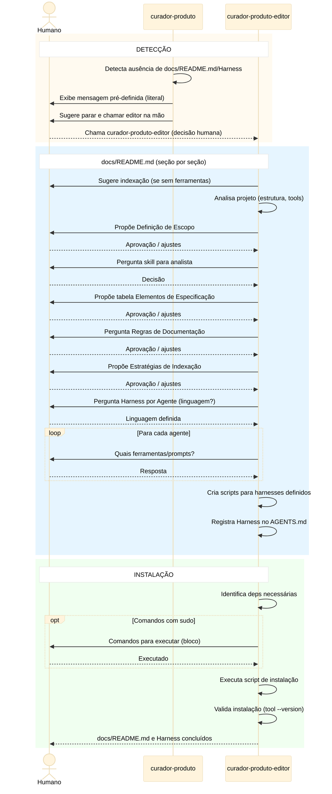

# Workflow de Curadoria — docs/README.md e Harness

## Objetivo

Processo de curadoria que produz e mantém dois artefatos
duráveis para o projeto:

1. **docs/README.md** — contrato de documentação (3 seções)
2. **Harnesses por agente** — regras de contenção no
   `AGENTS.md`

Dois agentes participam deste processo:
- **`curador-produto`** — guardião. Detecta ausência ou
  inconsistência do docs/README.md/Harness. Não edita.
- **`curador-produto-editor`** — executor. Cria e altera o
  docs/README.md e os scripts de harness. Chamado pelo
  humano diretamente ou pelo `curador-produto` quando
  detecta necessidade.

> **Nota sobre P6:** os agentes não conhecem workflows
> nem fases. Este documento é o design do processo;
> cada agente o implementa como capacidade autônoma.

## Posicionamento na Sequência de Workflows

Este workflow é executado **antes** do workflow de
definição de escopo e do workflow de desenvolvimento:

```
devflow → workflow-curadoria → workflow-definicao-escopo → PLANEJAMENTO
```

- **Autônomo**: este workflow nunca chama o `analista`.
  A elicitação de requisitos é responsabilidade do
  `workflow-definicao-escopo.md`.
- **Pré-requisito**: o `workflow-definicao-escopo.md`
  assume que a curadoria já foi concluída (docs/README.md
  e Harness presentes e válidos).

---

## Filosofia

A curadoria opera com mentalidade ágil: **documentação
de mais é tão ruim quanto documentação de menos**. Os
princípios abaixo orientam toda decisão sobre o que
documentar e como manter:

1. **Código é documentação** — é o design da aplicação.
   Ferramentas que extraem conhecimento do código
   (grafos, ASTs, schemas) são preferíveis a docs
   manuais que repetem o que o código já diz.
2. **Doc derivável não se armazena** — se pode ser
   gerada a partir do código, gere sob demanda.
3. **Doc é complementar ao código, não substituta** —
   o dev prefere código. Doc separada só vale quando
   contextualiza agentes, comunica com stakeholders ou
   agrega abstração que o código não expressa.
4. **Transformação justifica doc** — só manter doc
   separada se houver mudança de formato
   (texto→diagrama), abstração (código→visão
   condensada) ou sumarização (decisões dispersas→visão
   consolidada).
5. **Docs devem ser executáveis** — preferir
   especificações testáveis. Decisões arquiteturais
   viram fitness functions; critérios de aceitação
   viram specs executáveis.
6. **Brownfield é pragmático** — pode não comportar
   técnicas avançadas. Grafos de conhecimento
   (não-intrusivos) ajudam muito. Sugerir gradualismo.
7. **Doc atualizada ou nenhuma** — doc desatualizada é
   pior que ausência.

> Estes princípios vivem em
> [`agents/references/principios-documentacao.md`](../agents/references/principios-documentacao.md)
> e orientam tanto o `curador-produto` quanto o
> `curador-produto-editor` ao propor e validar o
> docs/README.md.
> O docs/README.md não é catálogo exaustivo: é o
> mínimo necessário de doc complementar ao código.

---

## Premissas

### docs/README.md

1. **O projeto precisa de um docs/README.md** — arquivo
   que define como a documentação do produto se organiza
   e como deve ser mantida. Funciona como contrato de
   documentação: permite ao `curador-produto` validar
   entradas e verificar consistência. Contém 3 seções
   obrigatórias:

   #### Definição de Escopo

   Define a estrutura do que o `analista` deve elicitar.
   O `curador-produto-editor` entrevista o humano para
   definir esta seção **antes** do analista atuar.

   **Padrão sugerido:**

   ```markdown
   ## Definição de Escopo
   O analista deve elicitar:
   - Requisitos funcionais e não funcionais
   - Critérios de aceitação por exemplos
   - Organizados por histórias de usuário
   - Critérios devem referenciar requisitos funcionais
   - Nenhum requisito pode ficar sem critério
   Skill recomendada: (opcional — humano define)
   ```

   O humano pode customizar. Editor entrevista para
   definir a estrutura, analista elicita o conteúdo.

   **Skill para o analista**: editor pergunta ao humano
   se quer que o analista use alguma skill específica
   (ex: `grill-me`, `spec-driven-development`). Se sim,
   registra na seção. Analista lê e usa.

   #### Elementos de Especificação

   | Elemento | Formato/Ferramenta | Agente Responsável | Destino |
   |----------|-------------------|-------------------|---------|
   | Critérios de Aceite + Requisitos | Concordion | eng-software | docs/specs/ |
   | Regras de Produto | Tabela | eng-software | nenhum |
   | Modelo de Dados | DBML | dba | docs/modelo.dbml |
   | Threat Model | Markdown | sec | docs/threat-model.md |
   | Plano de Testes | Markdown | qa | nenhum |
   | Identidade Visual | Protótipo HTML/SVG | front | plan/ui/ |
   | ADR (Arquitetura) | Markdown | eng-software | docs/adr/ |

   **Coluna "Destino":**
   - Caminho = artefato extraído para local definitivo
     antes de descartar o arquivo de planejamento
   - `nenhum` = descartado ao final do ciclo junto com
     o arquivo de planejamento

   **Todos os elementos são obrigatórios** — ou fornecidos
   pelo humano, ou criados durante o workflow. Outros
   agentes podem sugerir modificações em qualquer
   especificação.

   Recomenda `docs/` como padrão, respeita convenções
   existentes do projeto.

   #### Regras de Documentação

   Subseções opcionais dentro do `docs/README.md` — só
   existem para elementos que o humano quis detalhar.
   Elementos sem regras específicas não precisam de
   subseção.

   **Exemplo:**

   ```markdown
   ##### Critérios de Aceite + Requisitos
   Os critérios de aceite devem estar organizados por
   Funcionalidade levando-se em conta a coesão. Cada
   funcionalidade deve ter um arquivo Concordion
   separado. Os requisitos associados aos critérios
   de aceitação devem estar no mesmo arquivo, e os
   critérios devem referenciar os requisitos que
   estão sendo atendidos.
   ```

   (demais elementos: só criar subseção se houver
   regra específica a registrar)

   #### Estratégias de Indexação de Código

   Seção no final do `docs/README.md` com técnicas para
   ajudar agentes IA a encontrar informação rapidamente
   e consumir menos tokens.

   **Ferramentas padrão sugeridas:**
   - codebase-memory

   O curador ou editor orientam o humano a instalar as
   ferramentas selecionadas.

2. **`curador-produto` é o guardião do docs/README.md** —
   se o arquivo não existir, `curador-produto` detecta a
   ausência e chama `curador-produto-editor` para criá-lo.
   `curador-produto` valida e detecta, mas **não edita**
   o docs/README.md diretamente — delega ao
   `curador-produto-editor`. O humano decide o conteúdo;
   `curador-produto-editor` orienta o processo.
   **`curador-produto-editor` é o único agente que altera
   diretamente o docs/README.md.**

3. **Posicionamento recomendado** — o docs/README.md deve
   ficar em `docs/README.md` na raiz do projeto.

### Harness por Agente

4. **Harness é definido no AGENTS.md** — o harness de
   cada agente fica em uma tabela no **topo do AGENTS.md**
   do projeto. Não é hardcoded no prompt do agente. O
   `curador-produto-editor` cria e mantém os scripts de
   harness e registra a tabela no AGENTS.md. Cada projeto
   define quais regras e ferramentas compõem o harness de
   cada agente.
   **Fonte única obrigatória** — nenhum agente assume
   harness embutido por ferramenta. Toda ferramenta,
   regra ou exceção de harness deve estar registrada no
   AGENTS.md.
   **Registro obrigatório por agente** — no AGENTS.md,
   cada agente deve ter uma entrada na tabela de harness
   com um dos cenários abaixo:
   - Se houver comando de execução, o harness está
     definido e o script deve existir.
   - Se contiver `(sem harness)` com descrição
     `SEM HARNESS A PEDIDO DO HUMANO`, considera-se
     decisão explícita de não usar harness.
   **Preferência por ferramentas determinísticas** —
   sempre que possível, regras de harness devem ser
   implementadas via ferramentas determinísticas (linters,
   análise estática, testes automatizados, validadores
   de schema) em vez de depender apenas de instruções
   de prompt. Ferramentas determinísticas produzem
   resultados reproduzíveis e verificáveis.
   **Script único por harness definido** — cada agente com
   harness aprovado tem um único script executável que
   encapsula todas as verificações. O script segue a
   interface padronizada (sem argumentos, JSON stdout,
   exit code).

5. **Execução obrigatória na construção e revisão da
   construção** — o agente com harness definido sempre
   executa o comando do AGENTS.md ao final da sua atividade
   nessas fases. O script é idempotente.

### Pré-requisito: `curador-produto-editor`

6. **`curador-produto-editor` cria e altera o
   docs/README.md e os scripts de harness** — é o único
   agente que edita esses artefatos. O `curador-produto`
   detecta ausência e delega ao `curador-produto-editor`.

### Convenção: Interface Padronizada de Harness

- **Chamada**: comando livre registrado no AGENTS.md
  (bash, python, node, qualquer coisa)
- **Script único por agente** — sem argumentos, sem
  parâmetro de fase. Paths de diretórios, configs e
  ferramentas ficam definidos internamente no script.
- **Saída stdout**: JSON com schema fixo:

  ```json
  {
    "status": "pass | fail",
    "findings": [
      {
        "severity": "bloqueante | melhoria",
        "tool": "eslint | ruff | manual | ...",
        "message": "descrição do problema"
      }
    ],
    "prompt": "instrução adicional para o agente (opcional)"
  }
  ```

- **Exit code**: 0 = pass, 1 = fail.
- **Versionamento**: scripts entram no git como artefatos
  do projeto.
- **Idempotente**: o mesmo script roda em construção e
  revisão. Sem separação por fase.

**Comportamento do agente:**
1. Ao final da execução (construção ou revisão),
    roda o comando do AGENTS.md quando houver harness
2. `fail` → lê `findings`, tenta resolver, roda
   harness novamente
3. `pass` → lê `prompt`, executa se houver
4. `SEM HARNESS A PEDIDO DO HUMANO` → não executa
   harness
5. Seção ausente/vazia → registra LACUNA e interrompe
6. Persiste saída JSON na seção
   `## Evidências de Harness` do arquivo de planejamento

**O script existe para cada harness definido.** O
`curador-produto-editor` cria o script quando o humano
aprova ferramentas ou regras para o agente. Entradas com
`SEM HARNESS A PEDIDO DO HUMANO` não geram script e o
agente não executa harness. Se a entrada estiver ausente
ou vazia, registra LACUNA e o workflow aguarda decisão
do humano.

**Portabilidade:** linguagem livre por projeto;
contrato é a interface (sem argumento + JSON + exit code).

```
harness/<agente>
```

- O caminho não presume linguagem nem extensão; o AGENTS.md registra o comando
  executável real do projeto.
- **Interface**: sem argumentos. Saída JSON em stdout:
  `{ "status": "pass | fail", "findings": [...], "prompt": "..." }`
- **Exit code**: 0 = pass, 1 = fail.
- **Idempotente**: mesmo script para construção e revisão.
- **Versionamento**: scripts entram no git como artefatos
  do projeto.
- **Maturidade gradual**: projetos podem começar com
  harness prompt-only e migrar para scripts à medida que
  amadurecem. O `curador-produto` orienta essa migração.

---

## Fluxo do Processo de Curadoria

### Detecção de Ausência

Quando o `curador-produto` detecta que o docs/README.md
e/ou o Harness não existem:

1. Exibe a mensagem pré-definida de
   `agents/references/mensagens-curadoria.md` (copiar/colar
   literal, sem alterar).
2. Sugere ao humano parar o workflow e chamar
   `curador-produto-editor` na mão.
3. **Não delega automaticamente** ao editor — o humano
   decide se prossegue.

### Criação do docs/README.md e Harness

O processo de criação inicia quando o
`curador-produto-editor` é acionado pelo humano
diretamente (após o preâmbulo do curador) ou pelo
`curador-produto` em cenários de docs/README.md
desatualizado.

O `curador-produto-editor` analisa o contexto e segue o
fluxo em 4 fases com aprovação do humano:

#### Fase 1 — Bootstrap (somente se os artefatos não existirem)

1. **Sugere indexação do código** — se não houver
   ferramentas de indexação configuradas, sugira ao
   humano instalar (codebase-memory ou equivalente).
2. Analisa o projeto (estrutura, ferramentas, docs).
3. Apresenta ao humano o que encontrou (resumo).
4. Copia `default-artifacts/doc-readme.md` para
   `docs/README.md` do projeto, sem editar.
5. Copia `default-artifacts/harness-section.md` para o
   topo do `AGENTS.md` do projeto, sem editar.
6. Informa ao humano o que foi copiado antes de avançar.

#### Fase 2 — Revisão do docs/README.md (item por item)

- Mostra cada seção ao humano e aguarda aprovação ou
  ajuste ANTES de editar. Nunca avança sem aprovação
  explícita da anterior. Nunca edita em lote.
- Seções a revisar:
  - **Definição de Escopo** — entrevista o humano para
    definir a estrutura do que o analista deve elicitar.
  - **Elementos de Especificação** — propõe tabela
    inicial → humano aprova/ajusta.
  - **Regras de Documentação** — pergunta se o humano
    quer registrar regras específicas.
  - **Estratégias de Indexação de Código** — propõe
    ferramentas → humano aprova/ajusta.

#### Fase 3 — Revisão do Harness (item por item)

- Primeiro pergunta ao humano em qual linguagem/tecnologia
  criar os scripts.
- Mostra o conteúdo padrão de CADA entrada ao humano.
- Aguarda aprovação ou ajuste de CADA entrada antes de
  avançar.
- Acumula todas as decisões sem criar nada.
- **PROIBIDO criar scripts antes da Fase 3 estar 100%
  concluída.** Somente após TODOS os itens aprovados,
  cria scripts para os harnesses definidos. Entradas
  marcadas `SEM HARNESS A PEDIDO DO HUMANO` não geram
  script.

#### Fase 4 — Implementação

- Aplica edições no `docs/README.md` conforme aprovado
  na Fase 2.
- Cria os scripts de harness conforme aprovado na Fase 3.
- Registra tabela no topo do `AGENTS.md`.
- **Instalação de dependências** — quando todas as
  entradas de harness tiverem decisão explícita, identifica
  deps necessárias. Se houver comandos com `sudo`, entrega
  ao humano em bloco de código. Executa o restante e
  valida (`tool --version`).

**Interrupção a qualquer momento** — o humano pode
interromper o processo em qualquer etapa. Nesse caso o
`curador-produto-editor`:
- Confirma com o humano se realmente deseja encerrar.
- Atualiza o docs/README.md com o que já foi decidido.
- Para cada agente sem harness por decisão explícita,
  registra `SEM HARNESS A PEDIDO DO HUMANO`.
- Para cada agente sem decisão, registra LACUNA e
  interrompe o workflow até o humano decidir.

---

## Diagrama de Sequência



---

## Catálogo de Sugestões de Harness por Agente

> **Nota importante:** as regras abaixo são um catálogo
> de referência para o `curador-produto` usar ao orientar
> o humano na criação de harness. **Não são regras
> obrigatórias.** O harness efetivo de cada agente é
> definido no AGENTS.md de cada projeto.

### eng-software

- **Instalação de deps de harness** `tool` `build · val`
  Se uma execução exigir ferramenta ausente de harness,
  pode executar o script de instalação de harness do
  projeto, respeitando o docs/README.md e registrando
  evidências da instalação/verificação.

- **Smoke tests pós-construção** `prompt` `build`
  Executar todos os testes ao final da etapa de
  construção. Só prosseguir para a próxima fase se todos
  passarem.

- **Testes existentes são intocáveis** `prompt` `build`
  Se um teste que não estava previsto para modificação
  falhar após alterações, não ajustá-lo. Registrar a
  falha no arquivo e perguntar ao humano se o problema
  é no código novo ou no teste.

- **Regressão incremental** `prompt` `build`
  Após cada modificação em código que já possui testes
  sem previsão de alteração, executar esses testes para
  verificar que o comportamento existente não foi
  afetado.

- **Análise estática** `tool` `build · val`
  Usar ferramentas determinísticas do projeto (ESLint,
  ruff, mypy, pyright, shellcheck, hadolint, etc.) para
  validar o código antes de declarar a etapa concluída.
  Achados bloqueantes devem ser corrigidos antes de
  prosseguir.

### dba

- **Validação de SQL** `tool` `build · val`
  Executar SQLFluff (ou linter SQL do projeto) em toda
  migration/DDL produzida. Achados de severidade error
  são bloqueantes.

- **Schema diff** `tool` `build`
  Após gerar migration, comparar schema resultante com o
  modelo "as code" (DBML/Prisma/etc.) usando diff
  automatizado. Divergências bloqueiam avanço.

- **IaC lint** `tool` `build · val`
  Se há infra de BD (Terraform, CloudFormation), validar
  com checkov/tflint antes de declarar concluído.

- **Nomenclatura determinística** `prompt` `build · val`
  Verificar se tabelas, colunas e índices seguem
  convenção do projeto (definida no docs/README.md).
  Divergências devem ser apontadas.

### sec

> **Regra de precedência:** as ferramentas efetivas do
> `sec` são as registradas no AGENTS.md. Os itens
> abaixo são catálogo de referência para o humano e o
> `curador-produto`.

- **SAST obrigatório** `tool` `build · val`
  Executar Semgrep (ou SAST do projeto) no código
  alterado. Findings de severidade high/critical são
  bloqueantes.

- **Secrets scan** `tool` `build`
  Executar gitleaks/git-secrets no diff. Qualquer
  segredo detectado é bloqueante.

- **Dependency check** `tool` `val`
  Verificar dependências com Snyk/npm audit/pip-audit.
  Vulnerabilidades críticas são bloqueantes.

- **OWASP Top 10 checklist** `prompt` `val`
  Na revisão, verificar se o código exposto trata os
  riscos OWASP aplicáveis. Registrar quais itens foram
  verificados e quais não se aplicam.

- **DAST** `tool` `val`
  OWASP ZAP baseline quando app disponível.
  Findings de severidade high/critical são bloqueantes.

### qa

- **Cobertura mínima** `tool` `val`
  Verificar se cobertura de testes não caiu em relação
  ao baseline. Queda acima do threshold do projeto
  bloqueia.

- **Testes de aceitação** `tool` `val`
  Executar specs de aceitação (BDD/Playwright/Cypress)
  definidas no plano. Falhas são bloqueantes.

- **Relatório estruturado** `prompt` `val`
  Produzir relatório com: total executados, passaram,
  falharam, skipped, cobertura delta. Persistir no
  arquivo de planejamento.

- **Acessibilidade (se aplicável)** `tool` `val`
  Em projetos frontend, executar axe-core ou equivalente.
  Violations de severidade critical são bloqueantes.

### rev

- **Markdown lint** `tool` `val`
  Executar markdownlint nos artefatos de documentação
  produzidos. Erros de formatação devem ser reportados.

- **Link check** `tool` `val`
  Verificar links internos/externos em docs produzidas
  (markdown-link-check). Links quebrados são reportados.

- **Consistência cross-artefato** `prompt` `val`
  Verificar que nomes, convenções e referências são
  consistentes entre plano, código, testes e docs.
  Inconsistências viram achados no relatório.

- **Aderência ao plano** `prompt` `val`
  Comparar o que foi construído com o que foi planejado.
  Desvios não autorizados são achados bloqueantes.

- **Aderência à identidade visual** `prompt` `val`
  Quando houver protótipos de tela aprovados, verificar
  se a implementação respeita a identidade visual
  aprovada. Desvios não autorizados são bloqueantes.

### front

- **Validação do humano (gate visual)** `prompt` `build`
  Após gerar protótipos, apresentar ao humano para
  aprovação. Iterar até aprovação explícita. Sem
  aprovação, a identidade visual não é considerada
  contrato e a construção não avança.

- **Lint CSS/HTML** `tool` `build · val`
  Executar stylelint, htmlhint ou equivalente nos
  componentes produzidos. Achados bloqueantes devem
  ser corrigidos.

- **Acessibilidade** `tool` `build · val`
  Executar axe-core, pa11y ou equivalente nos
  componentes produzidos. Violations de severidade
  critical são bloqueantes.

- **Snapshot visual** `tool` `val`
  Se o projeto usar Playwright/Cypress, executar testes
  de snapshot visual comparando implementação contra
  referência aprovada. Divergências são reportadas.

- **Aderência à identidade visual** `prompt` `val`
  Na revisão, comparar telas implementadas contra
  protótipos aprovados. Desvios não autorizados pelo
  humano são bloqueantes.

### curador-produto

- **Checklist do docs/README.md** `prompt` `val`
  Ao revisar, verificar se faltou atualizar alguma
  documentação com base no docs/README.md.

- **Delega atualização do docs/README.md** `prompt` `val`
  Quando a funcionalidade implementada altera estrutura,
  nomenclatura ou convenções do projeto, delegar ao
   `curador-produto-editor` a atualização do docs/README.md.

- **Valida existência de harness** `prompt` `val`
  Verificar se os agentes executores (`eng-software`,
  `dba`, `sec`, `qa`, `front`) possuem harness
   registrado no AGENTS.md. Agentes sem harness por design
  (`val-harness`, `curador-produto`, `rev`) não
  precisam de verificação.

- **Delega outros domínios** `prompt` `val`
  Para ajustes em código, BD ou segurança detectados na
  revisão, devolver instruções claras ao solicitante
  para delegar ao agente correto.
