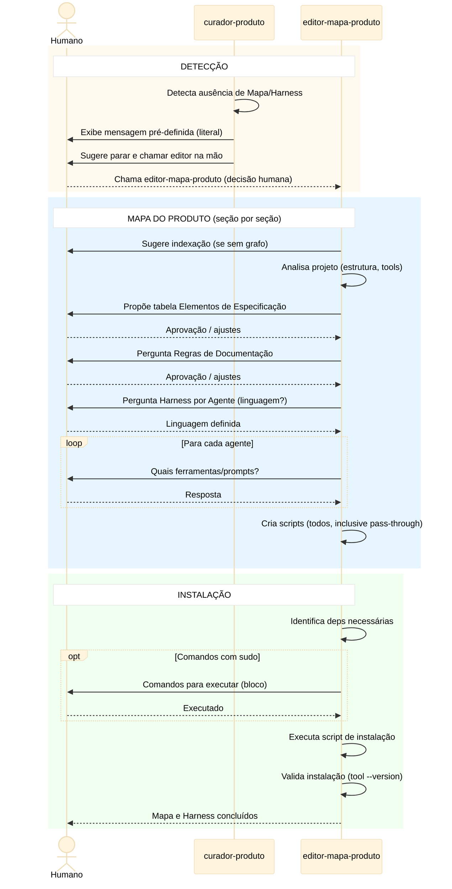

# Workflow de Curadoria — Mapa do Produto e Harness

## Objetivo

Processo de curadoria que produz e mantém dois artefatos
duráveis para o projeto:

1. **Mapa do Produto** — contrato de documentação
2. **Harnesses por agente** — regras de contenção

Dois agentes participam deste processo:
- **`curador-produto`** — guardião. Detecta ausência ou
  inconsistência do Mapa/Harness. Não edita.
- **`editor-mapa-produto`** — executor. Cria e altera o
  Mapa e os scripts de harness. Chamado pelo humano
  diretamente ou pelo `curador-produto` quando detecta
  necessidade.

> **Nota sobre P6:** os agentes não conhecem workflows
> nem fases. Este documento é o design do processo;
> cada agente o implementa como capacidade autônoma.

---

## Filosofia

A curadoria opera com mentalidade ágil: **documentação
de mais é tão ruim quanto documentação de menos**. Os
princípios abaixo orientam toda decisão sobre o que
documentar e como manter:

1. **Código é documentação** — é o design da aplicação.
   Ferramentas que extraem conhecimento do código
   (grafos, ASTs, schemas) são preferíveis a docs
   manuais que repetem o que o código já diz.
2. **Doc derivável não se armazena** — se pode ser
   gerada a partir do código, gere sob demanda.
3. **Doc é complementar ao código, não substituta** —
   o dev prefere código. Doc separada só vale quando
   contextualiza agentes, comunica com stakeholders ou
   agrega abstração que o código não expressa.
4. **Transformação justifica doc** — só manter doc
   separada se houver mudança de formato
   (texto→diagrama), abstração (código→visão
   condensada) ou sumarização (decisões dispersas→visão
   consolidada).
5. **Docs devem ser executáveis** — preferir
   especificações testáveis. Decisões arquiteturais
   viram fitness functions; critérios de aceitação
   viram specs executáveis.
6. **Brownfield é pragmático** — pode não comportar
   técnicas avançadas. Grafos de conhecimento
   (não-intrusivos) ajudam muito. Sugerir gradualismo.
7. **Doc atualizada ou nenhuma** — doc desatualizada é
   pior que ausência.

> Estes princípios vivem em
> [`agents/references/principios-documentacao.md`](../agents/references/principios-documentacao.md)
> e orientam tanto o `curador-produto` quanto o
> `editor-mapa-produto` ao propor e validar o Mapa.
> O Mapa do Produto não é catálogo exaustivo: é o
> mínimo necessário de doc complementar ao código.

---

## Premissas

### Mapa do Produto

1. **O projeto precisa de um "Mapa do Produto"** — seção
   no arquivo de contexto do agente (ex.: AGENTS.md,
   instructions.md) que define como a documentação do
   produto se organiza e como deve ser mantida. Funciona
   como contrato de documentação: permite ao
   `curador-produto` validar entradas e verificar
   consistência.
2. **Conteúdo do Mapa segue template default, customizável**
   — o processo oferece um template default com formato
   tabular fechado (anti-alucinação). O humano pode
   adicionar, remover ou alterar linhas. O template é
   ponto de partida, não prescrição. O Mapa funciona
   como o hotspot do framework: a estrutura é fixa, o
   Mapa é o ponto de variação por projeto.

   **Template Default:**

   O Mapa do Produto é composto por três seções
   obrigatórias:

   #### Elementos de Especificação

   | Elemento | Formato/Ferramenta | Origem | Destino |
   |----------|-------------------|--------|---------|
   | Critérios de Aceite + Requisitos | Concordion | História de Usuário em MD | docs/specs/ |
   | Regras de Produto | Tabela | arquivo de planej. | nenhum |
   | Modelo de Dados | DBML | arquivo de planej. | docs/modelo.dbml |
   | Threat Model | Markdown | arquivo de planej. | docs/threat-model.md |
   | Plano de Testes | Markdown | arquivo de planej. | nenhum |
   | Identidade Visual | Protótipo HTML/SVG | plan/ui/ | nenhum |
   | Code as Doc | Graphify | graphify-out/ | graphify-out/ |
   | ADR (Arquitetura) | Markdown | arquivo de planej. | docs/adr/ |

   **Coluna "Destino":**
   - Caminho = artefato extraído para local definitivo
     antes de descartar o arquivo de planejamento
   - `nenhum` = descartado ao final do ciclo junto com
     o arquivo de planejamento

   #### Regras de Documentação

   Subseções opcionais — só existem para elementos que
   o humano quis detalhar. Elementos sem regras
   específicas não precisam de subseção.

   **Exemplo:**

   ```markdown
   ##### Critérios de Aceite + Requisitos
   Os critérios de aceite devem estar organizados por
   Funcionalidade levando-se em conta a coesão. Cada
   funcionalidade deve ter um arquivo Concordion
   separado. Os requisitos associados aos critérios
   de aceitação devem estar no mesmo arquivo, e os
   critérios devem referenciar os requisitos que
   estão sendo atendidos.
   ```

   (demais elementos: só criar subseção se houver
   regra específica a registrar)

   #### Harness por Agente

   | Agente | Comando de Execução | Descrição |
   |--------|--------------------|-----------|
   | eng-software | harness/eng-software.sh | Testes, análise estática, regressão |
   | dba | harness/dba.sh | Validação de schema, migrações |
   | sec | harness/sec.sh | OWASP checks, secrets scan |
   | qa | harness/qa.sh | Cobertura, testes de aceitação |
   | front | harness/front.sh | Linting, a11y, aderência visual |
   | rev | (sem harness) | SEM HARNESS A PEDIDO DO HUMANO |
   | val-harness | (sem harness) | SEM HARNESS A PEDIDO DO HUMANO |
   | curador-produto | (sem harness) | SEM HARNESS A PEDIDO DO HUMANO |
3. **`curador-produto` é o guardião do Mapa** — se a seção
   não existir, `curador-produto` detecta a ausência e
   chama `editor-mapa-produto` para criá-lo.
   `curador-produto` valida e detecta, mas **não edita**
   o Mapa diretamente — delega ao `editor-mapa-produto`.
   O humano decide o conteúdo; `editor-mapa-produto`
   orienta o processo. **`editor-mapa-produto` é o
   único agente que altera diretamente o Mapa do
   Produto.**
4. **Posicionamento recomendado** — o Mapa do Produto deve
   ficar no **início** do arquivo de contexto, logo após
   as regras globais de comportamento. LLMs têm viés de
   primazia e o Mapa é contexto fundacional: o agente
   precisa entender o produto antes de interpretar
   regras e executar tarefas.

### Harness por Agente

5. **Harness é definido no Mapa do Produto** — o harness
   de cada agente é um artefato do projeto, definido e
   mantido no Mapa do Produto. Não é hardcoded no prompt
   do agente. O `editor-mapa-produto` cria e mantém os
   scripts de harness. Cada projeto define quais regras e
   ferramentas compõem o harness de cada agente.
   **Fonte única obrigatória** — nenhum agente assume
   harness embutido por ferramenta. Toda ferramenta,
   regra ou exceção de harness deve estar registrada no
   Mapa do Produto.
   **Registro obrigatório por agente** — no Mapa, cada
   agente deve ter uma entrada na tabela de harness com
   um dos cenários abaixo:
   - Se houver comando de execução, o harness está
     definido e o script deve existir.
   - Se contiver `(sem harness)` com descrição
     `SEM HARNESS A PEDIDO DO HUMANO`, considera-se
     decisão explícita de não usar harness.
   **Preferência por ferramentas determinísticas** —
   sempre que possível, regras de harness devem ser
   implementadas via ferramentas determinísticas (linters,
   análise estática, testes automatizados, validadores
   de schema) em vez de depender apenas de instruções
   de prompt. Ferramentas determinísticas produzem
   resultados reproduzíveis e verificáveis.
   **Script único por agente** — cada agente tem um
   único script executável que encapsula todas as
   verificações. O script segue a interface padronizada
   (sem argumentos, JSON stdout, exit code).

6. **Execução obrigatória na construção e revisão da
   construção** — o agente sempre executa o comando do
   Mapa ao final da sua atividade nessas fases. O script
   é idempotente.

### Pré-requisito: `editor-mapa-produto`

7. **`editor-mapa-produto` cria e altera o Mapa e os
   scripts de harness** — é o único agente que edita
   esses artefatos. O `curador-produto` detecta
   ausência e delega ao `editor-mapa-produto`.

### Convenção: Interface Padronizada de Harness

- **Chamada**: comando livre registrado no Mapa
  (bash, python, node, qualquer coisa)
- **Script único por agente** — sem argumentos, sem
  parâmetro de fase. Paths de diretórios, configs e
  ferramentas ficam definidos internamente no script.
- **Saída stdout**: JSON com schema fixo:

  ```json
  {
    "status": "pass | fail",
    "findings": [
      {
        "severity": "bloqueante | melhoria",
        "tool": "eslint | ruff | manual | ...",
        "message": "descrição do problema"
      }
    ],
    "prompt": "instrução adicional para o agente (opcional)"
  }
  ```

- **Exit code**: 0 = pass, 1 = fail.
- **Versionamento**: scripts entram no git como artefatos
  do projeto.
- **Idempotente**: o mesmo script roda em construção e
  revisão. Sem separação por fase.

**Comportamento do agente:**
1. Ao final da execução (construção ou revisão),
   roda o comando do Mapa
2. `fail` → lê `findings`, tenta resolver, roda
   harness novamente
3. `pass` → lê `prompt`, executa se houver
4. Persiste saída JSON na seção
   `## Evidências de Harness` do arquivo de planejamento

**O script sempre existe.** O `editor-mapa-produto` cria
um script para **todos** os agentes ao montar o Mapa.
Se o humano não definiu ferramentas ou regras para um
agente, o script retorna `{ "status": "pass" }` sem
verificações (pass-through). Assim o agente **sempre
chama** o script sem se preocupar se há algo
configurado ou não.

**Portabilidade:** linguagem livre por projeto;
contrato é a interface (sem argumento + JSON + exit code).

```
harness/<agente>/<fase>.sh
```

- **Interface**: recebe como `$1` o path do arquivo de
  planejamento.
- **Saída**: exit 0 (ok) / exit 1 (bloqueante). Achados em
  stdout, uma linha por achado:
  `SEVERITY | TOOL | MESSAGE`
- **Versionamento**: scripts entram no git como artefatos
  do projeto.
- **Maturidade gradual**: projetos podem começar com
  harness prompt-only e migrar para scripts à medida que
  amadurecem. O `curador-produto` orienta essa migração.

---

## Fluxo do Processo de Curadoria

### Detecção de Ausência

Quando o `curador-produto` detecta que o Mapa do Produto
e/ou o Harness não existem:

1. Exibe a mensagem pré-definida de
   `agents/references/mensagens-curadoria.md` (copiar/colar
   literal, sem alterar).
2. Sugere ao humano parar o workflow e chamar
   `editor-mapa-produto` na mão.
3. **Não delega automaticamente** ao editor — o humano
   decide se prossegue.

### Criação do Mapa e Harness

O processo de criação inicia quando o `editor-mapa-produto`
é acionado pelo humano diretamente (após o preâmbulo do
curador) ou pelo `curador-produto` em cenários de Mapa
desatualizado.

O `editor-mapa-produto` analisa o contexto e segue o
fluxo seção por seção com aprovação do humano:

1. **Sugere indexação do código** — se não houver
   grafo de conhecimento (ex.: `graphify-out/`),
   sugere ao humano instalar e rodar uma ferramenta
   de indexação (ex.: Graphify) como primeiro passo.

2. **Mapa do Produto** — analisa o projeto, apresenta
   resumo ao humano, propõe tabela de Elementos de
   Especificação. Humano aprova/refina. Pergunta sobre
   Regras de Documentação. Humano decide.

3. **Harness por Agente** — pergunta ao humano em qual
   linguagem/tecnologia criar os scripts. Para cada
   agente, pergunta quais ferramentas e/ou prompts
   compõem o harness. Cria scripts para todos os
   agentes (inclusive pass-through para os sem regras).

4. **Instalação de dependências** — quando todos os
   harnesses estiverem definidos, identifica deps
   necessárias. Se houver comandos com `sudo`, entrega
   ao humano em bloco de código. Executa o restante e
   valida (`tool --version`).

**Interrupção a qualquer momento** — o humano pode
interromper o processo em qualquer etapa. Nesse caso o
`editor-mapa-produto`:
- Confirma com o humano se realmente deseja encerrar.
- Atualiza o Mapa do Produto com o que já foi decidido.
- Para cada agente cujo harness não foi definido,
  registra `SEM HARNESS A PEDIDO DO HUMANO`.
- Isso garante que o workflow dev prossiga sem
  interrupções por ausência de harness.

---

## Diagrama de Sequência



---

## Catálogo de Sugestões de Harness por Agente

> **Nota importante:** as regras abaixo são um catálogo
> de referência para o `curador-produto` usar ao orientar
> o humano na criação de harness. **Não são regras
> obrigatórias.** O harness efetivo de cada agente é
> definido no Mapa do Produto de cada projeto.

### eng-software

- **Instalação de deps de harness** `tool` `build · val`
  Se uma execução exigir ferramenta ausente de harness,
  pode executar o script de instalação de harness do
  projeto, respeitando o Mapa do Produto e registrando
  evidências da instalação/verificação.

- **Smoke tests pós-construção** `prompt` `build`
  Executar todos os testes ao final da etapa de
  construção. Só prosseguir para a próxima fase se todos
  passarem.

- **Testes existentes são intocáveis** `prompt` `build`
  Se um teste que não estava previsto para modificação
  falhar após alterações, não ajustá-lo. Registrar a
  falha no arquivo e perguntar ao humano se o problema
  é no código novo ou no teste.

- **Regressão incremental** `prompt` `build`
  Após cada modificação em código que já possui testes
  sem previsão de alteração, executar esses testes para
  verificar que o comportamento existente não foi
  afetado.

- **Análise estática** `tool` `build · val`
  Usar ferramentas determinísticas do projeto (ESLint,
  ruff, mypy, pyright, shellcheck, hadolint, etc.) para
  validar o código antes de declarar a etapa concluída.
  Achados bloqueantes devem ser corrigidos antes de
  prosseguir.

### dba

- **Validação de SQL** `tool` `build · val`
  Executar SQLFluff (ou linter SQL do projeto) em toda
  migration/DDL produzida. Achados de severidade error
  são bloqueantes.

- **Schema diff** `tool` `build`
  Após gerar migration, comparar schema resultante com o
  modelo "as code" (DBML/Prisma/etc.) usando diff
  automatizado. Divergências bloqueiam avanço.

- **IaC lint** `tool` `build · val`
  Se há infra de BD (Terraform, CloudFormation), validar
  com checkov/tflint antes de declarar concluído.

- **Nomenclatura determinística** `prompt` `build · val`
  Verificar se tabelas, colunas e índices seguem
  convenção do projeto (definida no Mapa do Produto).
  Divergências devem ser apontadas.

### sec

> **Regra de precedência:** as ferramentas efetivas do
> `sec` são as registradas no Mapa do Produto. Os itens
> abaixo são catálogo de referência para o humano e o
> `curador-produto`.

- **SAST obrigatório** `tool` `build · val`
  Executar Semgrep (ou SAST do projeto) no código
  alterado. Findings de severidade high/critical são
  bloqueantes.

- **Secrets scan** `tool` `build`
  Executar gitleaks/git-secrets no diff. Qualquer
  segredo detectado é bloqueante.

- **Dependency check** `tool` `val`
  Verificar dependências com Snyk/npm audit/pip-audit.
  Vulnerabilidades críticas são bloqueantes.

- **OWASP Top 10 checklist** `prompt` `val`
  Na revisão, verificar se o código exposto trata os
  riscos OWASP aplicáveis. Registrar quais itens foram
  verificados e quais não se aplicam.

- **DAST** `tool` `val`
  OWASP ZAP baseline quando app disponível.
  Findings de severidade high/critical são bloqueantes.

### qa

- **Cobertura mínima** `tool` `val`
  Verificar se cobertura de testes não caiu em relação
  ao baseline. Queda acima do threshold do projeto
  bloqueia.

- **Testes de aceitação** `tool` `val`
  Executar specs de aceitação (BDD/Playwright/Cypress)
  definidas no plano. Falhas são bloqueantes.

- **Relatório estruturado** `prompt` `val`
  Produzir relatório com: total executados, passaram,
  falharam, skipped, cobertura delta. Persistir no
  arquivo de planejamento.

- **Acessibilidade (se aplicável)** `tool` `val`
  Em projetos frontend, executar axe-core ou equivalente.
  Violations de severidade critical são bloqueantes.

### rev

- **Markdown lint** `tool` `val`
  Executar markdownlint nos artefatos de documentação
  produzidos. Erros de formatação devem ser reportados.

- **Link check** `tool` `val`
  Verificar links internos/externos em docs produzidas
  (markdown-link-check). Links quebrados são reportados.

- **Consistência cross-artefato** `prompt` `val`
  Verificar que nomes, convenções e referências são
  consistentes entre plano, código, testes e docs.
  Inconsistências viram achados no relatório.

- **Aderência ao plano** `prompt` `val`
  Comparar o que foi construído com o que foi planejado.
  Desvios não autorizados são achados bloqueantes.

- **Aderência à identidade visual** `prompt` `val`
  Quando houver protótipos de tela aprovados, verificar
  se a implementação respeita a identidade visual
  aprovada. Desvios não autorizados são bloqueantes.

### front

- **Validação do humano (gate visual)** `prompt` `build`
  Após gerar protótipos, apresentar ao humano para
  aprovação. Iterar até aprovação explícita. Sem
  aprovação, a identidade visual não é considerada
  contrato e a construção não avança.

- **Lint CSS/HTML** `tool` `build · val`
  Executar stylelint, htmlhint ou equivalente nos
  componentes produzidos. Achados bloqueantes devem
  ser corrigidos.

- **Acessibilidade** `tool` `build · val`
  Executar axe-core, pa11y ou equivalente nos
  componentes produzidos. Violations de severidade
  critical são bloqueantes.

- **Snapshot visual** `tool` `val`
  Se o projeto usar Playwright/Cypress, executar testes
  de snapshot visual comparando implementação contra
  referência aprovada. Divergências são reportadas.

- **Aderência à identidade visual** `prompt` `val`
  Na revisão, comparar telas implementadas contra
  protótipos aprovados. Desvios não autorizados pelo
  humano são bloqueantes.

### curador-produto

- **Checklist do Mapa** `prompt` `val`
  Ao revisar, verificar se faltou atualizar alguma
  documentação com base no Mapa do Produto.

- **Delega atualização do Mapa** `prompt` `val`
  Quando a funcionalidade implementada altera estrutura,
  nomenclatura ou convenções do projeto, delegar ao
  `editor-mapa-produto` a atualização do Mapa.

- **Valida existência de harness** `prompt` `val`
  Verificar se os agentes executores (`eng-software`,
  `dba`, `sec`, `qa`, `front`) possuem harness
  registrado no Mapa. Agentes sem harness por design
  (`val-harness`, `curador-produto`, `rev`) não
  precisam de verificação.

- **Delega outros domínios** `prompt` `val`
  Para ajustes em código, BD ou segurança detectados na
  revisão, devolver instruções claras ao solicitante
  para delegar ao agente correto.
