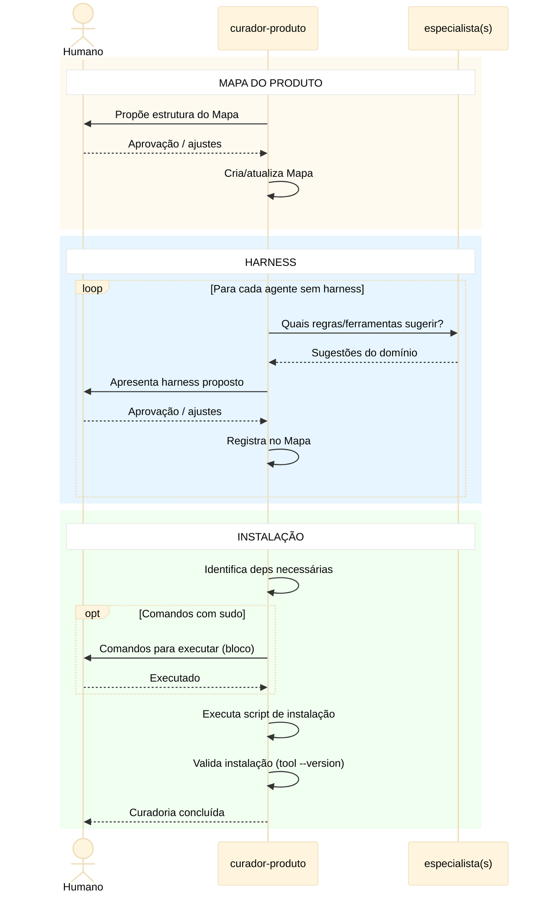

# Workflow de Curadoria — Mapa do Produto e Harness

## Objetivo

Processo de curadoria que produz e mantém dois artefatos
duráveis para o projeto:

1. **Mapa do Produto** — contrato de documentação
2. **Harnesses por agente** — regras de contenção

O `curador-produto` é o agente que implementa este
processo como **capacidade interna**. Ele executa a
curadoria tanto quando chamado diretamente pelo humano
quanto quando detecta ausência de Mapa/Harness durante
o workflow de desenvolvimento.

> **Nota sobre P6:** o `curador-produto` não conhece
> workflows nem fases. Este documento é o design do
> processo; o agente o implementa como capacidade
> autônoma — da mesma forma que `eng-software`
> implementa TDD sem conhecer a sequência de fases.

---

## Premissas

### Mapa do Produto

1. **O projeto precisa de um "Mapa do Produto"** — seção
   no arquivo de contexto do agente (ex.: AGENTS.md,
   instructions.md) que define como a documentação do
   produto se organiza e como deve ser mantida. Funciona
   como contrato de documentação: permite ao
   `curador-produto` validar entradas e verificar
   consistência.
2. **Conteúdo do Mapa é livre** — o processo não prescreve
   formato nem conteúdo. Cada projeto preenche conforme
   sua realidade. O Mapa funciona como o hotspot do
   framework: a estrutura é fixa, o Mapa é o ponto de
   variação por projeto.
3. **`curador-produto` é o guardião do Mapa** — se a seção
   não existir, `curador-produto` detecta a ausência e
   pode sugerir uma organização inicial ao humano ou
   aceitar o que o humano fornecer. O humano decide o
   conteúdo; `curador-produto` orienta o processo se
   solicitado. **É o único agente que atualiza
   diretamente o Mapa do Produto.**
4. **Posicionamento recomendado** — o Mapa do Produto deve
   ficar no **início** do arquivo de contexto, logo após
   as regras globais de comportamento. LLMs têm viés de
   primazia e o Mapa é contexto fundacional: o agente
   precisa entender o produto antes de interpretar
   regras e executar tarefas.

### Harness por Agente

5. **Harness é definido no Mapa do Produto** — o harness
   de cada agente é um artefato do projeto, definido e
   mantido no Mapa do Produto. Não é hardcoded no prompt
   do agente. `curador-produto` é co-responsável por
   orientar o humano na criação e registra o harness no
   Mapa. Cada projeto define quais regras e ferramentas
   compõem o harness de cada agente.
   **Fonte única obrigatória** — nenhum agente assume
   harness embutido por ferramenta. Toda ferramenta,
   regra ou exceção de harness deve estar registrada no
   Mapa do Produto.
   **Registro obrigatório por agente** — no Mapa, cada
   agente deve ter uma seção no bloco de harness com um
   dos cenários abaixo:
   - Se a seção tiver descrição de regras/ferramentas,
     o harness está definido e deve ser executado.
   - Se a seção não existir ou estiver vazia, o harness
     não está definido para aquele agente.
   - Se a seção contiver a frase literal
     `SEM HARNESS A PEDIDO DO HUMANO`, considera-se
     decisão explícita de não usar harness naquele caso.
   **Preferência por ferramentas determinísticas** —
   sempre que possível, regras de harness devem ser
   implementadas via ferramentas determinísticas (linters,
   análise estática, testes automatizados, validadores
   de schema) em vez de depender apenas de instruções
   de prompt. Ferramentas determinísticas produzem
   resultados reproduzíveis e verificáveis.
   **Implementação preferencial: scripts executáveis** —
   a forma recomendada de implementar harness é via
   scripts que encapsulam as verificações determinísticas.
   Scripts produzem resultado binário (passa/falha),
   geram evidência automaticamente e são versionáveis.

6. **Fase de aplicação obrigatória** — o Mapa do Produto
   deve registrar para cada regra de harness quando ela
   se aplica: `build` (construção), `val` (revisão) ou
   ambos. Harness é **obrigatório na construção e na
   revisão**, sempre que o agente altera artefatos.

### Convenção recomendada de scripts

A convenção abaixo é **recomendada** — o humano decide se
a adota ou usa outra estrutura.

```
harness/<agente>/<fase>.sh
```

- **Interface**: recebe como `$1` o path do arquivo de
  planejamento.
- **Saída**: exit 0 (ok) / exit 1 (bloqueante). Achados em
  stdout, uma linha por achado:
  `SEVERITY | TOOL | MESSAGE`
- **Versionamento**: scripts entram no git como artefatos
  do projeto.
- **Maturidade gradual**: projetos podem começar com
  harness prompt-only e migrar para scripts à medida que
  amadurecem. O `curador-produto` orienta essa migração.

---

## Fluxo do Processo de Curadoria

O processo inicia quando o `curador-produto` já
identificou (durante o workflow dev ou por chamada
direta do humano) que faltam Mapa do Produto e/ou
harness. Não há fase de diagnóstico — a detecção
já ocorreu.

O curador analisa o contexto e decide o que precisa
fazer:

1. **Mapa do Produto** — se não existir ou estiver
   incompleto, propõe estrutura inicial ao humano.
   Humano aprova/refina. Curador cria/atualiza a
   seção no arquivo de contexto.

2. **Harness por especialista** — para cada agente sem
   harness definido, spawna o especialista do domínio
   (`eng-software`, `dba`, `sec`, `qa`) para obter
   sugestões de regras/ferramentas. Consolida e
   apresenta ao humano. Humano aprova/refina. Curador
   registra no Mapa com tags `build`/`val`. Se o humano
   decidir não usar harness para um agente, registrar:
   `SEM HARNESS A PEDIDO DO HUMANO`.

3. **Instalação de dependências** — quando todos os
   harnesses estiverem definidos, identifica deps
   necessárias. Se houver comandos com `sudo`, entrega
   ao humano em bloco de código. Executa o restante e
   valida (`tool --version`). A instalação bem-sucedida
   é a validação — não há fase separada.

**Interrupção a qualquer momento** — o humano pode
interromper o processo em qualquer etapa. Nesse caso o
curador:
- Confirma com o humano se realmente deseja encerrar.
- Atualiza o Mapa do Produto com o que já foi decidido.
- Para cada agente cujo harness não foi definido,
  registra `SEM HARNESS A PEDIDO DO HUMANO`.
- Isso garante que o workflow dev prossiga sem
  interrupções por ausência de harness.

---

## Diagrama de Sequência



---

## Catálogo de Sugestões de Harness por Agente

> **Nota importante:** as regras abaixo são um catálogo
> de referência para o `curador-produto` usar ao orientar
> o humano na criação de harness. **Não são regras
> obrigatórias.** O harness efetivo de cada agente é
> definido no Mapa do Produto de cada projeto.

### eng-software

- **Instalação de deps de harness** `tool` `build · val`
  Se uma execução exigir ferramenta ausente de harness,
  pode executar o script de instalação de harness do
  projeto, respeitando o Mapa do Produto e registrando
  evidências da instalação/verificação.

- **Smoke tests pós-construção** `prompt` `build`
  Executar todos os testes ao final da etapa de
  construção. Só prosseguir para a próxima fase se todos
  passarem.

- **Testes existentes são intocáveis** `prompt` `build`
  Se um teste que não estava previsto para modificação
  falhar após alterações, não ajustá-lo. Registrar a
  falha no arquivo e perguntar ao humano se o problema
  é no código novo ou no teste.

- **Regressão incremental** `prompt` `build`
  Após cada modificação em código que já possui testes
  sem previsão de alteração, executar esses testes para
  verificar que o comportamento existente não foi
  afetado.

- **Análise estática** `tool` `build · val`
  Usar ferramentas determinísticas do projeto (ESLint,
  ruff, mypy, pyright, shellcheck, hadolint, etc.) para
  validar o código antes de declarar a etapa concluída.
  Achados bloqueantes devem ser corrigidos antes de
  prosseguir.

### dba

- **Validação de SQL** `tool` `build · val`
  Executar SQLFluff (ou linter SQL do projeto) em toda
  migration/DDL produzida. Achados de severidade error
  são bloqueantes.

- **Schema diff** `tool` `build`
  Após gerar migration, comparar schema resultante com o
  modelo "as code" (DBML/Prisma/etc.) usando diff
  automatizado. Divergências bloqueiam avanço.

- **IaC lint** `tool` `build · val`
  Se há infra de BD (Terraform, CloudFormation), validar
  com checkov/tflint antes de declarar concluído.

- **Nomenclatura determinística** `prompt` `build · val`
  Verificar se tabelas, colunas e índices seguem
  convenção do projeto (definida no Mapa do Produto).
  Divergências devem ser apontadas.

### sec

> **Regra de precedência:** as ferramentas efetivas do
> `sec` são as registradas no Mapa do Produto. Os itens
> abaixo são catálogo de referência para o humano e o
> `curador-produto`.

- **SAST obrigatório** `tool` `build · val`
  Executar Semgrep (ou SAST do projeto) no código
  alterado. Findings de severidade high/critical são
  bloqueantes.

- **Secrets scan** `tool` `build`
  Executar gitleaks/git-secrets no diff. Qualquer
  segredo detectado é bloqueante.

- **Dependency check** `tool` `val`
  Verificar dependências com Snyk/npm audit/pip-audit.
  Vulnerabilidades críticas são bloqueantes.

- **OWASP Top 10 checklist** `prompt` `val`
  Na revisão, verificar se o código exposto trata os
  riscos OWASP aplicáveis. Registrar quais itens foram
  verificados e quais não se aplicam.

### qa

- **Cobertura mínima** `tool` `val`
  Verificar se cobertura de testes não caiu em relação
  ao baseline. Queda acima do threshold do projeto
  bloqueia.

- **Testes de aceitação** `tool` `val`
  Executar specs de aceitação (BDD/Playwright/Cypress)
  definidas no plano. Falhas são bloqueantes.

- **Relatório estruturado** `prompt` `val`
  Produzir relatório com: total executados, passaram,
  falharam, skipped, cobertura delta. Persistir no
  arquivo de planejamento.

- **Acessibilidade (se aplicável)** `tool` `val`
  Em projetos frontend, executar axe-core ou equivalente.
  Violations de severidade critical são bloqueantes.

### rev

- **Markdown lint** `tool` `val`
  Executar markdownlint nos artefatos de documentação
  produzidos. Erros de formatação devem ser reportados.

- **Link check** `tool` `val`
  Verificar links internos/externos em docs produzidas
  (markdown-link-check). Links quebrados são reportados.

- **Consistência cross-artefato** `prompt` `val`
  Verificar que nomes, convenções e referências são
  consistentes entre plano, código, testes e docs.
  Inconsistências viram achados no relatório.

- **Aderência ao plano** `prompt` `val`
  Comparar o que foi construído com o que foi planejado.
  Desvios não autorizados são achados bloqueantes.

### curador-produto

- **Checklist do Mapa** `prompt` `val`
  Ao revisar, verificar se faltou atualizar alguma
  documentação com base no Mapa do Produto.

- **Atualiza Mapa diretamente** `prompt` `val`
  Quando a funcionalidade implementada altera estrutura,
  nomenclatura ou convenções do projeto, atualizar o Mapa
  do Produto diretamente (sem delegar).

- **Valida existência de harness** `prompt` `val`
  Verificar se todos os agentes que atuam no projeto
  possuem harness registrado no Mapa. Se não, alertar
  o humano.

- **Delega outros domínios** `prompt` `val`
  Para ajustes em código, BD ou segurança detectados na
  revisão, devolver instruções claras ao solicitante
  para delegar ao agente correto.
