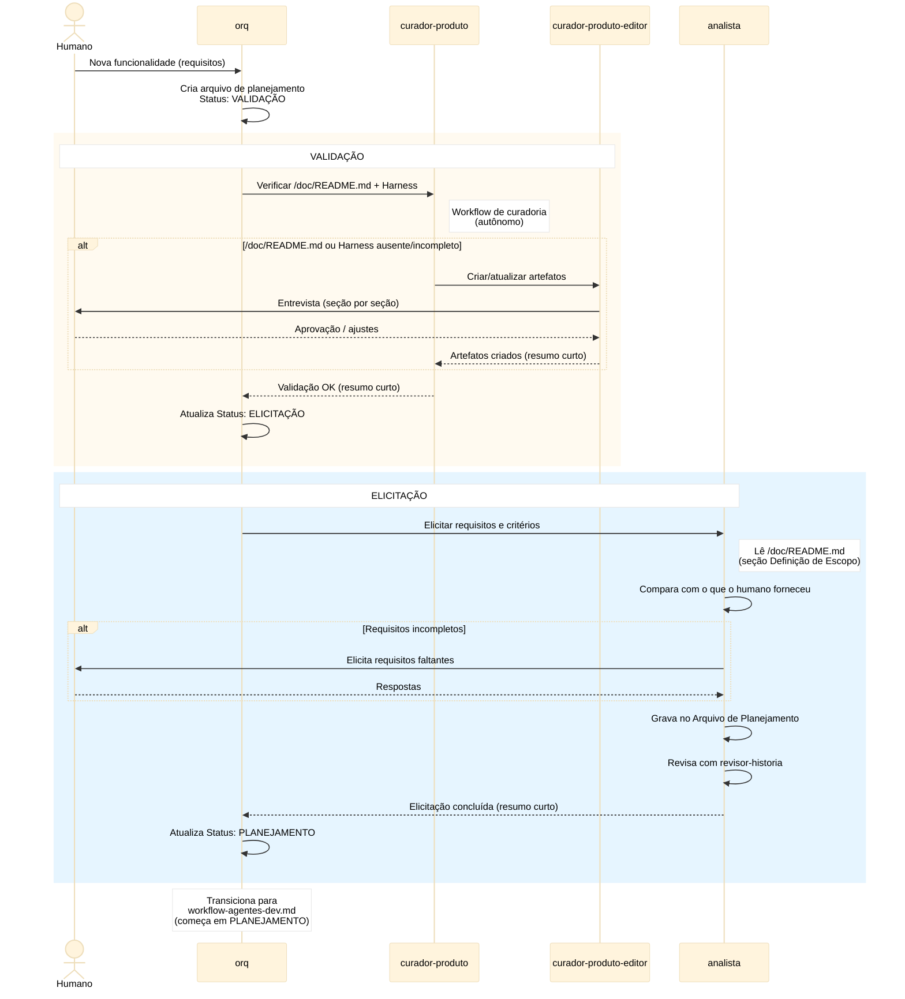

# Workflow de Definição de Escopo

## Objetivo

Workflow preparatório que garante as condições mínimas
para o workflow de desenvolvimento iniciar:

1. **Validação** — verifica existência e aderência ao
   `/doc/README.md` (3 seções) e Harness no `AGENTS.md`
2. **Elicitação** — analista elicita requisitos e
   critérios com o humano, grava no Arquivo de
   Planejamento

Este workflow **substitui** a antiga fase de VALIDAÇÃO
do workflow de desenvolvimento. O `orq` agora inicia
por aqui, que produz o Arquivo de Planejamento e só
então transiciona para o workflow de desenvolvimento
(que começa em PLANEJAMENTO).

## Agentes

| Sigla             | Nome completo          | Tipo               | Fases onde atua     |
|-------------------|------------------------|---------------------|---------------------|
| `orq`             | Orquestrador           | Roteador stateless  | todas (roteia)      |
| `curador-produto` | Curador de Produto     | Executor            | Validação           |
| `curador-produto-editor` | Editor de Produto | Executor         | Validação (se necessário) |
| `analista`        | Analista de Backlog    | Executor            | Elicitação          |

## Premissas

1. **`orq` como roteador stateless** — spawna agentes,
   não lê, não valida. Recebe resumo curto de volta.
2. **Workflow de curadoria é autônomo** — o curador
   chama o workflow de curadoria internamente. Este
   workflow **nunca** chama o `analista`.
3. **`analista` nunca edita `/doc/README.md`** — apenas
   lê a seção Definição de Escopo para contextualizar
   a elicitação.
4. **Arquivo de Planejamento é criado aqui** — o `orq`
   cria o arquivo no início deste workflow (antes era
   criado no início do dev).
5. **Transição para dev** — quando o analista conclui
   a elicitação, `orq` transiciona para o workflow de
   desenvolvimento, que começa em PLANEJAMENTO.

## Fluxo

### Fase 1: Validação

`orq` spawna `curador-produto`, que executa o workflow
de curadoria (autônomo):

1. Verifica existência do `/doc/README.md` com 3 seções:
   - Definição de Escopo
   - Elementos de Especificação
   - Estratégias de Indexação de Código
2. Verifica existência do Harness no `AGENTS.md`
3. Se faltar algo → spawna `curador-produto-editor`
   - Editor entrevista o humano, cria/atualiza
4. Quando tudo OK → retorna resumo curto ao `orq`

### Fase 2: Elicitação

`orq` spawna `analista`:

1. Analista lê `/doc/README.md` (seção Definição de
   Escopo) + o que o humano forneceu
2. Compara: bate com o definido na seção?
3. Se faltar → elicita com humano
4. Grava no Arquivo de Planejamento
5. Usa `revisor-historia` para revisar
6. Quando OK → retorna resumo curto ao `orq`

### Transição

`orq` atualiza o `Status` do Arquivo de Planejamento
para `PLANEJAMENTO` e inicia o workflow de
desenvolvimento (`docs/workflow-agentes-dev.md`).

## Fluxo — Diagrama de Sequência

## Regras Críticas

- `workflow-curadoria` **nunca** chama `analista` —
  mantém autonomia
- `analista` **nunca** edita `/doc/README.md`
- `curador-produto-editor` cria a seção Definição de
  Escopo no `/doc/README.md` **antes** do analista atuar
- `orq` é roteador stateless — só spawna, não lê, não
  valida
