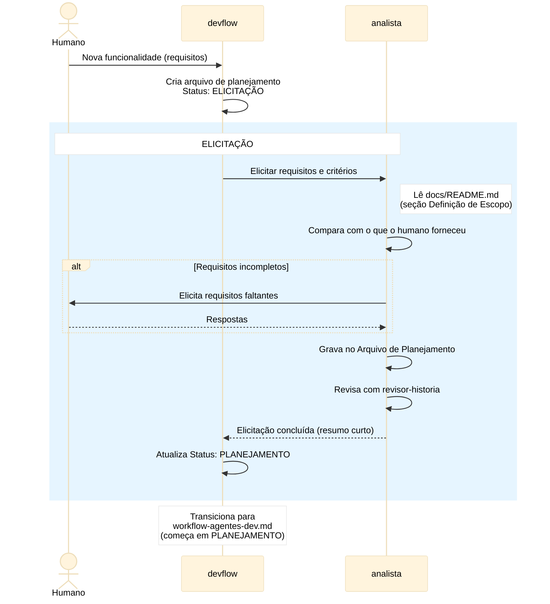

# Workflow de Definição de Escopo

## Objetivo

Workflow de elicitação que produz o Arquivo de
Planejamento com requisitos e critérios definidos pelo
humano.

**Premissa:** a curadoria já foi executada antes deste
workflow (docs/README.md e Harness presentes e válidos).
Ver [`workflow-curadoria.md`](workflow-curadoria.md).

O `devflow` executa este workflow após a curadoria e,
ao final, transiciona para o workflow de desenvolvimento
(que começa em PLANEJAMENTO).

## Agentes

| Sigla | Nome completo | Tipo | Fases onde atua |
|-------|--------------|------|----------------|
| `devflow` | Orquestrador | Roteador stateless | todas (roteia) |
| `analista` | Analista de Backlog | Executor | Elicitação |
| `revisor-historia` | Revisor de Histórias | Executor | Elicitação |

## Premissas

1. **`devflow` como roteador stateless** — spawna agentes,
   não lê, não valida. Recebe resumo curto de volta.
2. **Curadoria já foi concluída** — docs/README.md e
   Harness existem e estão válidos. Este workflow assume
   isso como pré-condição. A validação é feita pelo
   `workflow-curadoria.md`, que rodou antes.
3. **`analista` nunca edita `docs/README.md`** — apenas
   lê a seção Definição de Escopo para contextualizar
   a elicitação.
4. **Arquivo de Planejamento é criado aqui** — o `devflow`
   cria o arquivo no início deste workflow.
5. **Transição para dev** — quando o analista conclui
   a elicitação, `devflow` transiciona para o workflow de
   desenvolvimento, que começa em PLANEJAMENTO.
6. **Modo Debug** — se o humano ativou o modo debug
   (`modo debug on`), o `devflow` captura notas e skills
   durante a elicitação. Ver `agents/devflow.md`, seção
   "Modo Debug".

## Fluxo

### Elicitação

`devflow` spawna `analista`:

1. Analista lê `docs/README.md` (seção Definição de
   Escopo) + o que o humano forneceu
2. Compara: bate com o definido na seção?
3. Se faltar → elicita com humano
4. Grava no Arquivo de Planejamento
5. Usa `revisor-historia` para revisar
6. Quando OK → retorna resumo curto ao `devflow`

### Transição

`devflow` atualiza o `Status` do Arquivo de Planejamento
para `PLANEJAMENTO` e inicia o workflow de
desenvolvimento (`docs/workflow-agentes-dev.md`).

## Fluxo — Diagrama de Sequência

## Regras Críticas

- `analista` **nunca** edita `docs/README.md`
- `curador-produto-editor` cria a seção Definição de
  Escopo no `docs/README.md` **antes** do analista atuar
  (via workflow-curadoria.md)
- `devflow` é roteador stateless — só spawna, não lê,
  não valida
