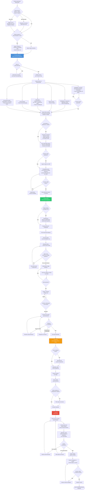

# Fluxo de Desenvolvimento

```mermaid
flowchart TD
    %% ── INÍCIO ──
    START([Humano pede para desenvolver]) --> CHK_INSUMO{Existe insumo?\nHistória, critérios,\nregras de negócio}

    CHK_INSUMO -- Sim --> CHK_DOC_REPO
    CHK_INSUMO -- Não informado --> PEDIR[Perguntar ao humano\nqual insumo usar]
    CHK_INSUMO -- Não existe --> SUGERIR[Sugerir uso do\n@analista para criar\nhistórias e critérios]
    PEDIR --> CHK_DOC_REPO
    SUGERIR --> CHK_DOC_REPO

    CHK_DOC_REPO{Existem regras de\ndocumentação no repo?}
    CHK_DOC_REPO -- Sim --> SEGUIR_REGRAS[Seguir regras existentes]
    CHK_DOC_REPO -- Não --> SUGERIR_DOC[Sugerir criação de:\n- Critérios de aceitação\n- ADR\n- Atualizar Agents.md]
    SEGUIR_REGRAS --> PLAN_START
    SUGERIR_DOC --> PLAN_START

    %% ── PLANEJAMENTO ──
    PLAN_START["🔹 PLANEJAMENTO\n(Modo Planning obrigatório)"]
    style PLAN_START fill:#4a90d9,color:#fff

    PLAN_START --> CHK_MODE{Está em\nmodo planning?}
    CHK_MODE -- Não --> INSISTIR[Insistir para o humano\ntrocar para modo planning]
    INSISTIR --> CHK_MODE
    CHK_MODE -- Sim --> ANALISAR[Analisar insumo\nsem construir nada]

    ANALISAR --> FRENTES[Avaliar frentes de conhecimento]

    FRENTES --> F_BD["Modelagem conceitual\n(@analista-bd Modo A: PLANEJAR)\n→ Plano de Modelagem de Dados"]
    FRENTES --> F_CYBER["Modelagem de segurança\n(@analista_cyber)\n→ Plano de Segurança"]
    FRENTES --> F_TESTES_M["Testes manuais\n→ Plano de Testes"]
    FRENTES --> F_COD["Codificação backend+frontend\ncom TDD + proporção de testes\n→ Plano de Codificação"]
    FRENTES --> F_DOC["Documentação\n→ Plano de Documentação"]
    FRENTES --> F_TESTES_E["Execução de testes\n(exploratórios, funcionais)\n→ Plano de Execução de Testes"]

    F_BD --> VALIDAR_BD{Humano aprova\nplano BD?}
    VALIDAR_BD -- Não --> F_BD
    VALIDAR_BD -- Sim --> JUNTAR

    F_CYBER --> JUNTAR
    F_TESTES_M --> JUNTAR
    F_COD --> JUNTAR
    F_DOC --> JUNTAR
    F_TESTES_E --> JUNTAR

    JUNTAR[Juntar todos os planos\nem Plano de Execução\ndividido em etapas]

    JUNTAR --> PESQUISA{Há dúvidas ou\nbibliotecas a validar?}
    PESQUISA -- Sim --> PESQUISAR["Pesquisar na internet\n- Resolver dúvidas\n- Validar segurança\n  de versões de libs"]
    PESQUISAR --> ESTIMAR
    PESQUISA -- Não --> ESTIMAR

    ESTIMAR["Para cada etapa estimar:\n- Nível de complexidade\n- Consumo de contexto"]

    ESTIMAR --> ADR_CHECK{Mudança afeta\narquitetura?}
    ADR_CHECK -- Sim --> SUGERIR_ADR[Sugerir registro em ADR]
    SUGERIR_ADR --> VALIDAR_PLAN
    ADR_CHECK -- Não --> VALIDAR_PLAN

    VALIDAR_PLAN["Compartilhar plano\ncom humano em partes pequenas\n(pessoas não gostam de ler muito)"]
    VALIDAR_PLAN --> HUMANO_OK_PLAN{Humano valida\no plano?}
    HUMANO_OK_PLAN -- Não --> AJUSTAR_PLAN[Ajustar plano\nconforme feedback]
    AJUSTAR_PLAN --> VALIDAR_PLAN
    HUMANO_OK_PLAN -- Sim --> SALVAR_PLAN["Salvar plano em arquivo\ne commitar"]

    %% ── EXECUÇÃO ──
    SALVAR_PLAN --> EXEC_START["🔹 EXECUÇÃO\n(Modo Build obrigatório)"]
    style EXEC_START fill:#2ecc71,color:#fff

    EXEC_START --> EXEC_BD{Plano envolve\nmodelagem BD?}
    EXEC_BD -- Sim --> EXEC_ANALISTA_BD["@analista-bd\nModo B: CONSTRUIR\n(usando plano gerado)"]
    EXEC_ANALISTA_BD --> EXEC_COD
    EXEC_BD -- Não --> EXEC_COD

    EXEC_COD["Executar Plano de Codificação"]
    EXEC_COD --> TDD_START["TDD: Red-Green-Refactor"]

    TDD_START --> TDD_WRITE["Escrever testes\nda funcionalidade nova"]
    TDD_WRITE --> TDD_RUN_FAIL["Executar testes\n→ TODOS devem falhar"]
    TDD_RUN_FAIL --> TDD_CHECK{Algum teste\npassou sem código\nprodutivo?}
    TDD_CHECK -- Sim --> TDD_FIX["Teste está errado\n→ Corrigir teste"]
    TDD_FIX --> TDD_RUN_FAIL
    TDD_CHECK -- Não, todos falharam --> TDD_IMPL["Implementar código\nprodutivo"]
    TDD_IMPL --> TDD_RUN_PASS["Executar TODOS os testes\ndo projeto"]
    TDD_RUN_PASS --> TDD_PASS{Todos passaram?}
    TDD_PASS -- Não --> TDD_IMPL
    TDD_PASS -- Sim --> TDD_REFACTOR["Avaliar e refatorar\ncódigo novo"]

    TDD_REFACTOR --> REFACTOR_CONFIRM{Confirmar refatoração\ncom humano}
    REFACTOR_CONFIRM -- Aprovado --> EXEC_AUTONOMO
    REFACTOR_CONFIRM -- Ajustar --> TDD_REFACTOR

    EXEC_AUTONOMO["Continuar execução\nautonomamente"]
    EXEC_AUTONOMO --> EXEC_PROBLEMA{Problema\nno caminho?}
    EXEC_PROBLEMA -- "Pequeno desvio" --> RESOLVER_SOZINHO[Resolver autonomamente]
    RESOLVER_SOZINHO --> EXEC_AUTONOMO
    EXEC_PROBLEMA -- "Grande desvio\nou dificuldade" --> PERGUNTAR_HUMANO_EXEC[Perguntar ao humano]
    PERGUNTAR_HUMANO_EXEC --> EXEC_AUTONOMO
    EXEC_PROBLEMA -- Não --> EXEC_FIM

    EXEC_FIM["Execução finalizada"]

    %% ── REVISÃO ──
    EXEC_FIM --> REV_START["🔹 REVISÃO\n(Modo Build, contexto limpo)"]
    style REV_START fill:#f39c12,color:#fff

    REV_START --> REV_BD{Houve mudança\nno BD?}
    REV_BD -- Sim --> REV_ANALISTA_BD["@analista-bd\nrevisar execução BD"]
    REV_ANALISTA_BD --> REV_CYBER
    REV_BD -- Não --> REV_CYBER

    REV_CYBER["@analista_cyber\nrevisar segurança"]
    REV_CYBER --> REV_RESTO["Revisar restante\ndo código"]

    REV_RESTO --> REV_AJUSTES["Fazer ajustes\nautonomamente"]
    REV_AJUSTES --> REV_DUVIDA{Muita mudança vs\nplanejamento original?}
    REV_DUVIDA -- Sim --> PERGUNTAR_HUMANO_REV[Pedir ajuda ao humano]
    PERGUNTAR_HUMANO_REV --> REV_FIM
    REV_DUVIDA -- Não --> REV_FIM

    REV_FIM["Revisão finalizada"]

    %% ── TESTES ──
    REV_FIM --> TEST_START["🔹 TESTES\n(Modo Build)"]
    style TEST_START fill:#e74c3c,color:#fff

    TEST_START --> TEST_AUTO["Rodar todos os testes\nautomatizados"]
    TEST_AUTO --> TEST_MANUAL["Executar plano de\ntestes manuais\n(como se fosse humano)"]
    TEST_MANUAL --> TEST_CYBER["@analista_cyber\ntestes funcionais de segurança\n(ex: penetração)"]

    TEST_CYBER --> TEST_AJUSTE{Ajustes\nnecessários?}
    TEST_AJUSTE -- Sim, pequeno --> AJUSTAR_AUTO["Ajustar autonomamente"]
    AJUSTAR_AUTO --> TEST_AUTO
    TEST_AJUSTE -- "Sim, grande desvio" --> PERGUNTAR_HUMANO_TEST[Pedir ajuda ao humano]
    PERGUNTAR_HUMANO_TEST --> TEST_AUTO
    TEST_AJUSTE -- Não --> TEST_FIM

    TEST_FIM["Sugerir apagar\narquivo de plano"]
    TEST_FIM --> PROPOR_COMMIT["Propor mensagem de commit\n⚠️ NÃO realizar o commit"]

    PROPOR_COMMIT --> HUMANO_OK_COMMIT{Humano valida\ne confirma commit?}
    HUMANO_OK_COMMIT -- Não --> AJUSTAR_COMMIT[Ajustar conforme feedback]
    AJUSTAR_COMMIT --> PROPOR_COMMIT
    HUMANO_OK_COMMIT -- Sim --> COMMIT["Realizar commit"]

    COMMIT --> FIM([Fluxo de Desenvolvimento\nfinalizado])
```
